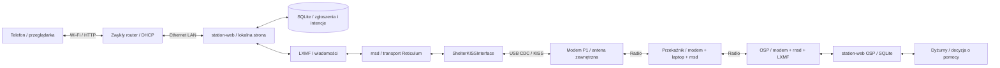

# 05. Projekt koncepcyjny komunikacji

## Podział funkcji

Bezpośrednie połączenie do OSP jest możliwe, gdy pozwalają na nie warunki radiowe. Schemat pokazuje drogę z przekaźnikiem. Przekaźnik musi mieć zasilany laptop i działający transport; sam modem nie trasuje pakietów. Router Wi-Fi nie bierze udziału w łączeniu stacji radiem.

`rnsd` działa niezależnie od lokalnej strony. Restart strony nie powinien przerywać przekazywania pakietów innych stacji. Aplikacja ma jedną bazę i jedną instancję routera LXMF dla tożsamości stacji. W OSP działa ten sam podział z rolą dyżurnego. [Implementacja transportu](https://reticulum.network/manual/understanding.html), [kontrakty WICI](../spec/oprogramowanie.md).

## Droga zgłoszenia

1. Telefon wysyła formularz przez lokalny HTTP. WICI sprawdza pola i atomowo zapisuje zgłoszenie, dostęp mieszkańca oraz intencję wysyłki.
2. Po COMMIT pokazuje **zapisane lokalnie**. Brak radia nie zmienia tego znaczenia. Błąd dysku nie może dać pozornego sukcesu.
3. Pracownik kolejki przekazuje treść SA1 do LXMF. Reticulum realizuje ochronę komunikacji i transport. Adapter przekazuje datagramy USB; modem dzieli je na ramki P1 i przestrzega budżetu TX.
4. Aktywne węzły pośrednie przekazują pakiety. OSP weryfikuje nadawcę, format i duplikat, następnie zapisuje zgłoszenie wraz z intencją RECEIVED.
5. **Dopiero po COMMIT w OSP** wysyłane jest RECEIVED. Źródło pokazuje **zapisane w OSP** po przyjęciu potwierdzenia od zaufanej tożsamości.
6. Dyżurny osobno zapisuje odczyt albo skierowanie pomocy. STATUS wraca tą samą siecią. Decyzja o wysłaniu ludzi nie wynika automatycznie z numeru pilności.

Potwierdzenie LXMF DELIVERED dotyczy transportu. Awaria między odbiorem transportowym a zapisem bazy nadal wymaga ponowienia zgłoszenia. WICI zachowuje jego id; OSP deduplikuje po uwierzytelnionym nadawcy, id i revision. Konflikt treści dla tego samego klucza nie nadpisuje danych. Kolejne zmiany mają nową revision. [LXMF](https://github.com/markqvist/LXMF), [transakcje i ponowienia](../spec/oprogramowanie.md).

## Interfejsy i granice odpowiedzialności

| Granica | Kontrakt | Co sprawdzić |
|---|---|---|
| Telefon–laptop | lokalny HTTP, token własnego zgłoszenia, panel opiekuna | 50 połączonych / 15 aktywnych; izolacja dostępu i brak zasobów internetowych |
| Aplikacja–nośnik | jedna baza SQLite; dane + intencja w jednej transakcji | fizyczne przerwanie zasilania i błąd zapisu; poprawna kopia i import |
| Aplikacja–LXMF | pięć wiadomości SA1, treść ≤480 B UTF-8, bez załączników | rzeczywiste pakiety i kontrola ponowień; content nie jest rozmiarem radiowym |
| Reticulum–modem | adapter ShelterKISSInterface, DATA/READY, osobna diagnostyka CDC | oczekiwanie na ciszę, odrzuty, restart, ograniczone bufory i powrót do odbioru |
| Modem–eter | profil P1, datagram 1–600 B, fragmenty do 86 B | zgodność TI–ST, emisje, CRC i składanie; całkowity czas TX |
| Stanowisko–dyżurny | kolejka przyjętych potrzeb i jawne statusy | dostępny człowiek, odczyt, decyzja i odpowiedź |

Szczegóły należą do [radia](../spec/radio.md) i [oprogramowania](../spec/oprogramowanie.md). Modem nie implementuje szyfrowania, ACK ani routingu. CRC wykrywa błędy ramki; nie uwierzytelnia nadawcy.

## Kolejki, opóźnienia i praca bez trasy

Własne zgłoszenia pozostają w SQLite do obsłużenia według kontraktu. LXMF prowadzi aktywną transmisję, a WICI nie rozpoczyna równoległego ponowienia tej samej intencji. ACK i statusy mają pierwszeństwo w kolejce aplikacji; inne stacje, transport i obcy ruch radiowy nie podlegają tej kolejce. WICI nie gwarantuje pilnemu zgłoszeniu czasu dostarczenia podczas przeciążenia.

Modem ma cztery miejsca na datagramy i osiem kontekstów składania. Przepełnienie musi być widoczne w licznikach. W prototypie trzeba określić również limit trwałej kolejki, wolnego miejsca i logów oraz zachowanie formularza po jego osiągnięciu; nie wolno pozornie potwierdzić odrzuconych danych.

Węzeł transportowy jest aktywnym przekaźnikiem, nie magazynem wszystkich cudzych zgłoszeń. Opcjonalny węzeł przechowywania LXMF w OSP jest inną funkcją i wymaga osobnych prób, zwłaszcza przy długim braku odbiorcy. [Role LXMF](https://github.com/markqvist/LXMF).

## Zaufanie i informacja lokalna

Kartę zaufanej OSP importuje się przed pracą, niezależnym uzgodnionym sposobem. Nazwa widoczna w radiu lub na stronie nie nadaje uprawnień. Nieznany nadawca zgłoszenia wymaga kwarantanny i decyzji dyżurnego. Statusy i komunikaty przyjmowane są wyłącznie od przypiętej OSP. Procedura wymiany i unieważniania kluczy pozostaje do opracowania przed pilotażem.

Szyfrowanie radiowe nie zabezpiecza lokalnego HTTP ani bazy na dysku. Nie wysyła się przez radio identyfikatorów osób lub dokumentów. Do wskazania potrzeby wystarczą lokalizacja, kategoria, liczba osób i krótki opis. Strona mieszkańca pokazuje jego zgłoszenie; kolejkę zbiorczą widzi opiekun. [Ograniczenia ochrony](07-zagrozenia-i-odpornosc.md).

Propozycja interfejsu: przy stanie łączności pokazywać czas ostatniej odpowiedzi OSP i wiek najstarszego oczekującego zgłoszenia, zamiast jednego zielonego wskaźnika. Komunikat OSP oznaczać odbiorcą, tożsamością źródła i momentem lokalnego odbioru. Poprawny podpis potwierdza źródło, nie aktualność ani prawdziwość treści. Zegara znalezionego laptopa nie traktować jako zaufanej podstawy koordynacji.

Dodatkowy kanał internetowy może przenosić ten sam stos po osobnej próbie. Podstawowe działanie nie zależy od jego obecności. Kopiowanie wiadomości na pendrive, automatyczna replikacja OSP i wspólna tablica mieszkańców nie należą do bazowego kontraktu komunikacji.
