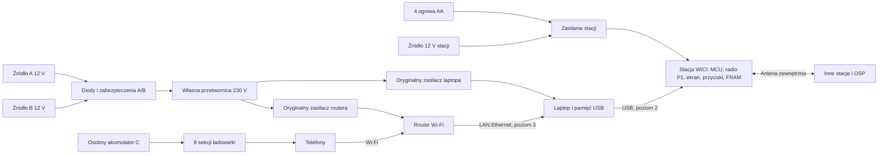

# WICI: projekt stacji

## Zakres

| Parametr | Wartość projektowa |
|---|---|
| Poziomy zestawu | 1: sama stacja; 2: stacja + laptop przez USB; 3: stacja + laptop + router Wi-Fi dla telefonów |
| Mieszkańcy | około 50; jedna stacja obsługuje obiekt niezależnie od liczby osób; strona poziomu 3 sprawdzana dla 15 aktywnych użytkowników jednocześnie; większy obiekt wymaga więcej osób obsługi |
| Sąsiednia stacja | cel: 1 km w zabudowie; wynik wymaga próby terenowej |
| Odbiorca zgłoszeń | skrót OSP oznacza rolę stanowiska odbiorczego wyznaczonego przez wójta (burmistrza, prezydenta miasta); rekomendowane gminne centrum zarządzania kryzysowego lub stanowisko gminnego zespołu zarządzania kryzysowego w urzędzie; jednostka Ochotniczej Straży Pożarnej tylko w porozumieniu z gminą |
| Informacje radiowe | zgłoszenia, odpowiedzi, statusy, komunikaty; bez zdjęć i głosu |
| Uruchomienie stacji | gotowość radiowa ≤60 s od włączenia, bez komputera; przekazywanie ruchu innych stacji zawsze, gdy stacja jest włączona |
| Zasilanie stacji | 4 wymienne ogniwa AA; wejście 12 V (11,5–16 V w pracy; pierwsze załączenie ≥12,0 V); przełączanie między nimi bez resetu |
| Czas pracy stacji | ≥48 h jako przekaźnik na ogniwach litowych AA; z akumulatorem 12 V: kilka tygodni (model: [rozdział 06](../conception/06-wykonalnosc-i-budzet-zasobow.html#energia-stacji-poziomu-1)) |
| Zasilanie poziomu 3 | 12 V; źródła A/B dla laptopa i routera, osobne C dla telefonów |
| Dopuszczalne źródła 12 V | akumulator kwasowo-ołowiowy 12 V, akumulator LiFePO4 12,8 V z BMS, wyjście 12 V stacji zasilania; 11,5–16 V na złączu A/B/C, odłączenie przy 11,5 V |
| Ciągłość | nowy akumulator podłączony przed odłączeniem starego |
| Praca przez dobę (poziom 3) | kolejne źródła z lokalnych zasobów; nie zakłada się pracy z jednego akumulatora |
| Przetwornica (poziom 3) | cel: 150 W mocy ciągłej, 230 V ±5%, 50 Hz, THD <5% |
| Gniazdo zapalniczki | profil do 8 A prądu wejściowego; może ograniczyć moc AC do około 70 W |
| Telefony (poziom 3) | 8 niezależnych portów USB-A, 5 V / 1,5 A, 60 W łącznie |

## Połączenie

Stacja jest jedynym węzłem sieci w schronieniu: przechowuje tożsamość i kolejkę zgłoszeń, obsługuje radio i przekazuje ruch innych stacji. Laptop jest panelem: przechowuje dane mieszkańców i stronę, a wiadomości przekazuje stacji przez USB. Router nie uczestniczy w łączności radiowej; zapewnia Wi-Fi, DHCP i połączenie telefonu z laptopem. Radio nie przekazuje stron WWW ani internetu. Poziom 3 można zasilić także z innego sprawdzonego źródła 230 V; przetwornica i pula A/B dotyczą tylko laptopa i routera.

## Zawartość zestawu

Poziom 1, zawsze w zestawie:

1. Stacja WICI w obudowie: radio P1, ekran, przyciski, koszyk na 4 ogniwa AA z wyłącznikiem, wejście 12 V, gniazdo USB do laptopa i złącze antenowe.
2. 4 ogniwa litowe AA w zamkniętym opakowaniu i drugi komplet zapasowy.
3. Antena zewnętrzna z uchwytem do stałego montażu, przewód koncentryczny o małym tłumieniu (np. LMR-240; do 2 m ≤1 dB, dłuższy wymaga nowego bilansu łącza) i przepust ścienny; zapasowy dipol z uchwytem do wystawienia przez okno.
4. Przewód zasilania stacji 12 V z bezpiecznikiem 1 A i końcówkami do gniazda zapalniczki oraz zacisków akumulatora.
5. Karta obsługi stacji w trzech językach (PL/UK/EN) z piktogramami kategorii.
6. Odbiornik bateryjny lub z korbką: FM i fale długie 225 kHz (Polskie Radio Program 1), w miarę możliwości DAB+, z zapasem baterii. Alert RCB i aplikacja RSO wymagają sieci komórkowej lub internetu, więc podczas awarii sieci schronienie ich nie odbierze.
7. Ręczny radiotelefon PMR446 jako głosowy kanał zastępczy, formularze papierowe zgłoszeń (kategoria, liczba osób, pilność, adres, krótki numer) do wypełniania w dwóch egzemplarzach i papierowy dziennik zmian.

Rozszerzenia poziomów 2–3:

8. Pamięć USB 64 GB z systemem, kompletnymi pakietami START i kluczem szyfrowania bazy laptopa; przewód USB do stacji.
9. Zespół zasilania laptopa i routera: dwa wejścia A/B i przetwornica, przewody do gniazda zapalniczki oraz do zacisków akumulatora, bezpieczniki przy źródłach.
10. Osobna ładowarka 8 portów i jej przewód akumulatorowy.
11. Przewód Ethernet, adapter USB–Ethernet z dołączonymi sterownikami i przejściówka USB-C do laptopa.
12. Przewody ładowania telefonów oraz jednostronicowa instrukcja strony.
13. Bateryjny czujnik tlenku węgla (CO) – obowiązkowa część zestawu poziomu 3.

Laptop, router, ich oryginalne zasilacze i akumulatory pochodzą z miejsca uruchomienia. Adapter sieciowy nie obsługuje każdego komputera. Jego kontroler również musi mieć dwa zakwalifikowane wykonania, np. Realtek RTL8153 i ASIX AX88179.

## Przygotowanie przed kryzysem

Osoba utrzymująca system, w porozumieniu z gminą, zapisuje w stacji dokładny adres i wejście schronienia oraz kartę zaufanej OSP. Robi to przez laptop z pakietem START, a kartę OSP otrzymuje uzgodnionym kanałem poza radiem. Stacja nigdy nie przyjmuje karty OSP przez radio od pierwszego napotkanego nadajnika. Następnie wysyła ze stacji TEST i zapisuje wynik.

Antenę zewnętrzną z przewodem i przepustem montuje się na stałe podczas przygotowania obiektu, za pisemną zgodą zarządcy, w miejscu wskazanym po próbie zasięgu. Przewodu nie prowadzi się przez drzwi hermetyczne, gazoszczelne ani przeciwpożarowe. W piwnicy lub garażu podziemnym stację umieszcza się na kondygnacji naziemnej albo stosuje dłuższy przewód o małym tłumieniu z nowym bilansem łącza. Wystawienie anteny przez okno jest procedurą zapasową.

Stacja jest przechowywana w obiekcie, w zamkniętej skrzynce, z kluczem u zarządcy i opiekuna; ogniwa leżą w zamkniętym opakowaniu. Magazyn gminy przechowuje zapas. Plan gminy wskazuje, kto i w jakim czasie dostarcza stacje do obiektów bez stałego wyposażenia. Opiekun i zastępcy przechodzą szkolenie z obsługi stacji i kurs pierwszej pomocy przed objęciem funkcji.

## Uruchomienie stacji (poziom 1)

1. Podłącz do stacji przewód anteny zamontowanej na stałe podczas przygotowania. Tylko gdy jej nie ma (procedura zapasowa): wyprowadź zapasowy dipol przez okno i ustaw go pionowo, w miarę możliwości wysoko i z dala od pomieszczenia z ludźmi; nie kładź go przy metalowej framudze ani nie prowadź przewodu przez drzwi hermetyczne, gazoszczelne lub przeciwpożarowe.
2. Włóż ogniwa AA albo podłącz źródło 12 V i włącz stację. Ekran pokazuje adres schronienia, stan energii i „RADIO GOTOWE”, gdy radio jest gotowe. Od tej chwili stacja przekazuje ruch innych stacji.
3. Wyślij TEST proponowany przez stację; stacja nadaje go z losowym opóźnieniem 0–15 min, chyba że OSP wstrzymała TEST komunikatem BULLETIN. Poczekaj, aż ekran pokaże „zapisane u odbiorcy” (RECEIVED), a potem „przeczytane” (STATUS od dyżurnego). Napis „RADIO GOTOWE” nie oznacza dostępności pomocy; „KONTAKT Z ODBIORCĄ” pojawia się tylko wtedy, gdy w ostatnich 60 min nadeszło RECEIVED lub STATUS od OSP.

Zgłoszenie schronienia: wybierz kategorię, liczbę osób, pilność i opcjonalnie gotową frazę, potem potwierdź. Ekran pokazuje „zapisane lokalnie”, potem „zapisane u odbiorcy”, „przeczytane” i decyzję dyżurnego: „pomoc skierowana”, „przekazane innemu podmiotowi”, „obecnie brak możliwości pomocy – użyj kanału zastępczego” albo „zamknięte”, oraz krótki numer zgłoszenia do przekazania telefonicznie lub przez gońca. Przy pilności 2 opiekun równolegle udziela pierwszej pomocy i – gdy droga jest bezpieczna – wysyła gońca do najbliższej jednostki PSP/OSP lub zespołu ratownictwa medycznego. WICI nie zastępuje numeru 112.

## Dołączenie laptopa i routera (poziomy 2–3)

Stacja pracuje dalej przez cały czas dołączania rozszerzeń.

1. Przy wyłączonym wyłączniku DC (pozycja 0) podłącz oryginalne zasilacze laptopa i routera do wyjść przetwornicy.
2. Podłącz źródło A do zespołu zasilania i źródło C do ładowarki. Sprawdź na woltomierzach, czy oba mają co najmniej 12,4 V, i włącz wyłącznik DC (pozycja 1).
3. Połącz laptop ze stacją przewodem USB, a na poziomie 3 także z portem LAN routera. Podłącz pamięć USB zestawu.
4. Uruchom START w działającym systemie albo system Linux z pamięci USB na obsługiwanym komputerze PC. Ustaw hasła opiekuna i zastępcy. Panel pokazuje adres i kartę OSP odczytane ze stacji.
5. Połącz telefon z główną siecią Wi-Fi routera i otwórz adres z kodu QR wyświetlonego na ekranie laptopa.

Nie podłączaj zasilaczy do pracującej przetwornicy: prąd ładowania ich kondensatorów może wyzwolić zabezpieczenie. Jeżeli router ma nieznane hasło, wyłączony DHCP lub izolację Wi-Fi od LAN, trzeba go skonfigurować w panelu. Wiele routerów domowych obsługuje najwyżej około 32 klientów Wi-Fi lub ma mniejszą pulę DHCP. Kwalifikacja routera obejmuje 50 klientów i pulę co najmniej 60 adresów. Zablokowany router znaleziony na miejscu pozostaje niedostępny: nie resetuj go bez zgody właściciela. Mac z procesorem Apple Silicon nie uruchomi ogólnego obrazu Linuksa, więc pakiet START wymaga na nim sprawnego systemu macOS. Komputer, którego nie da się uruchomić z pamięci USB i który nie ma sprawnego systemu, jest poza zakresem.

## Energia stacji

Stacja korzysta z wejścia 12 V, gdy jego napięcie jest powyżej 11,5 V, a w przeciwnym razie z ogniw AA. Przełączenie nie resetuje stacji. Ekran pokazuje aktywne źródło, napięcie i szacowany czas pracy. Przy niskim napięciu ogniw stacja ostrzega, zapisuje stan i wyłącza się w kontrolowany sposób. Ogniwa wymienia się przy włączonym źródle 12 V albo po wyłączeniu stacji; kolejka i dług ciszy pozostają w pamięci FRAM. Nie używaj ogniw różnych typów ani różnego stopnia rozładowania w jednym komplecie.

## Wymiana źródła A/B (poziom 3)

Podłącz nowe źródło do wolnego wejścia. Odłącz stare i sprawdź działanie laptopa i routera pod pełnym obciążeniem. Nie odłączaj obu naraz. Źródło wymieniaj, zanim jego napięcie spadnie do progu odłączenia 11,5 V; ostrzeżenie świetlne i dźwiękowe włącza się przy 11,8 V. Akumulator rozruchowy pojazdu wymieniaj już przy około 12,2 V. Po odłączeniu podnapięciowym przetwornica nie rusza sama: podłącz naładowane źródło i naciśnij RESTART. Ustawiony limit 8 A lub 20 A musi pasować do każdego źródła, które może przejąć zasilanie. Nie wolno przełączyć na 20 A tylko dlatego, że jedno z dwóch wejść ma mocniejszy przewód.

Wymiana źródła C może przerwać ładowanie telefonów, ale nie łączność. Wyłączenie całego poziomu 3 nie przerywa pracy stacji. Nie łącz plusów akumulatorów bezpośrednio. Nie uruchamiaj silnika pojazdu ani agregatu w schronieniu, w garażu, przy wejściu ani przy wlotach powietrza: tlenek węgla zabija bez ostrzeżenia. Wyjmij akumulator z pojazdu albo zasilaj zestaw z pojazdu stojącego na zewnątrz, kilka metrów od wejść i wlotów powietrza. Przewód nie może utrzymywać otwartych drzwi. Nie podłączaj zestawu przy pracującym silniku, chyba że wejście jest zakwalifikowane na impulsy według ISO 7637-2 ([elektronika](elektronika.md)). Bateryjny czujnik CO z zestawu poziomu 3 umieszcza się w pomieszczeniu z ludźmi. Nie ładuj akumulatorów w pomieszczeniu z ludźmi. Nie używaj źródła 24 V. Podstawowy wariant nie jest dopuszczony do pracy podczas rozruchu silnika.

## Przechowywanie i przeglądy

Zestaw może czekać na użycie latami. Przechowuje się go w obiekcie, w zamkniętej skrzynce, w suchym miejscu, w temperaturze pokojowej, bez akumulatorów podłączonych do wejść i z ogniwami AA w zamkniętym opakowaniu poza stacją.

Co kwartał opiekun wykonuje przegląd podstawowy: uruchomienie, TEST, napięcie ogniw, aktualność karty. Raz w roku i po każdym nowym wydaniu oprogramowania osoba kompetentna (serwis, krótkofalowiec, wyznaczony pracownik) wykonuje przegląd techniczny:

1. Włóż ogniwa, uruchom stację, sprawdź na ekranie adres i kartę OSP oraz napięcie obu kompletów ogniw. Wymień ogniwa przeterminowane albo o napięciu niższym niż podane w instrukcji.
2. Sprawdź sumy kontrolne obrazu na pamięci USB, bo pamięć flash bez zasilania traci dane. Wymień ją co kilka lat albo przechowuj drugą, sprawdzoną kopię.
3. Uruchom aplikację z przygotowanego zestawu na aktualnych komputerach z lokalnej listy; nowe wersje systemów mogą wymagać nowego pakietu START.
4. Nie rzadziej niż co 24 miesiące zmierz częstotliwość nadajnika, aby skontrolować starzenie TCXO ([radio](radio.md)), i sprawdź wymianę ramek ze stacją drugiego wykonania. Do oceny: ekran pokazuje odchyłkę częstotliwości oszacowaną z odebranych ramek jako tanią samokontrolę między przeglądami.
5. Uruchom przetwornicę i ładowarkę pod obciążeniem; kondensatory elektrolityczne starzeją się także bez pracy.
6. Wyślij TEST do OSP i sprawdź aktualność karty zaufanej OSP.

Wynik przeglądu zapisuje się z datą i wersją wydania w ewidencji sprzętu gminy. TEST z każdej stacji wysyła się raz w miesiącu w ustalonym, rozłożonym oknie czasowym; ćwiczenie całej sieci z OSP i gońcem odbywa się raz w roku w ramach gminnych ćwiczeń ([koncepcja, rozdział 02](../conception/02-scenariusze-i-organizacja.html#instrukcja-i-cwiczenie)).

## Rozstrzygnięcia

| Wybór | Uzasadnienie i koszt |
|---|---|
| Samodzielna stacja; laptop i router jako rozszerzenia | Łączność i przekaźnik bez znalezionego sprzętu i bez 230 V; oprogramowanie układowe stosu, kolejki i interfejsu na MCU |
| Stacja jedynym węzłem, laptop bez tożsamości Reticulum | Jedna tożsamość i jedna kolejka; potrzebny protokół USB stacja–laptop (D17) |
| microReticulum i LXMF na MCU | Gotowy stos zamiast własnego; młodszy projekt, zgodność do sprawdzenia w T3 |
| Ogniwa AA i wejście 12 V | Start bez ładowania i lata przechowywania; koszt ogniw i kontrola w przeglądzie |
| LXMF nad Reticulum | Gotowe dostarczanie wiadomości; stacja nadal odpowiada za trwały zapis, a OSP za decyzję |
| Mała własna strona HTTP | Telefon używa zwykłej przeglądarki; NomadNet nie jest takim interfejsem |
| 8 pojedynczych sekcji ładowania | Uszkodzenie jednej przetwornicy obniżającej wyłącza tylko jeden port; więcej dławików, prostsze naprawy |
| Pasywne diody A/B (poziom 3) | Bez kodu i sterowania; strata energii oraz konieczne chłodzenie |
| Mostek niskiego napięcia i transformator 50 Hz | Mniej stopni mocy; większa masa i możliwy większy koszt |
| Krótkie ramki radiowe | Mieszczą się w kolejce FIFO obu układów; dodatkowy narzut fragmentacji |
| Standardowy JSON w LXMF | Prosty format w stacji i laptopie; treść do 480 B, docelowo jeden pakiet okazjonalny (D01) |

Rolę NomadNet opisuje rozdział [Oprogramowanie](oprogramowanie.md). Nie wolno uruchamiać dwóch stacji z tą samą tożsamością ani routera LXMF na laptopie z tożsamością stacji. Węzeł przechowywania LXMF w OSP jest opcjonalny i nie należy do wydania 0.5: działałby jako osobny węzeł laboratoryjny z własną tożsamością albo jako przyszła funkcja po osobnych próbach. W sieci podstawowej ruch przechodzi przez aktywne przekaźniki. [NomadNet](https://github.com/markqvist/NomadNet), [LXMF](https://github.com/markqvist/LXMF).
