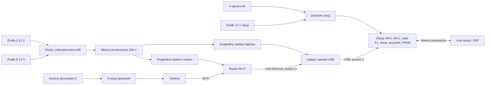

# WICI: projekt stacji

## Zakres

| Parametr | Wartość projektowa |
|---|---|
| Poziomy zestawu | 1: sama stacja; 2: stacja + laptop przez USB; 3: stacja + laptop + router Wi-Fi dla telefonów |
| Mieszkańcy | około 50; na poziomie 3 15 aktywnych użytkowników strony jednocześnie |
| Sąsiednia stacja | cel: 1 km w zabudowie; wynik wymaga próby terenowej |
| Odbiorca zgłoszeń | centrum zarządzania kryzysowego gminy lub punkt wskazany przez wójta; w specyfikacji jego rolę oznacza skrót OSP |
| Informacje radiowe | zgłoszenia, odpowiedzi, statusy, komunikaty; bez zdjęć i głosu |
| Uruchomienie stacji | gotowość radiowa ≤60 s od włączenia, bez komputera; przekazywanie ruchu innych stacji zawsze, gdy stacja jest włączona |
| Zasilanie stacji | 4 wymienne ogniwa AA; wejście 12 V (9–16 V); przełączanie między nimi bez resetu |
| Czas pracy stacji | ≥48 h jako przekaźnik na ogniwach litowych AA; z akumulatorem 12 V tygodnie (model: [rozdział 06](../conception/06-wykonalnosc-i-budzet-zasobow.html#energia-stacji-poziomu-1)) |
| Zasilanie poziomu 3 | 12 V; źródła A/B dla laptopa i routera, osobne C dla telefonów |
| Dopuszczalne źródła 12 V | akumulator kwasowo-ołowiowy 12 V, akumulator LiFePO4 12,8 V z BMS, wyjście 12 V stacji zasilania; 11,5–16 V na złączu A/B/C, odłączenie przy 11,5 V |
| Ciągłość | nowy akumulator podłączony przed odłączeniem starego |
| Praca przez dobę (poziom 3) | kolejne źródła z lokalnych zasobów; nie zakłada się pracy z jednego akumulatora |
| Przetwornica (poziom 3) | cel: 150 W mocy ciągłej, 230 V ±5%, 50 Hz, THD <5% |
| Gniazdo zapalniczki | profil do 8 A prądu wejściowego; może ograniczyć moc AC do około 70 W |
| Telefony (poziom 3) | 8 niezależnych portów USB-A, 5 V / 1,5 A, 60 W łącznie |

## Połączenie

Stacja jest jedynym węzłem sieci: przechowuje tożsamość i kolejkę zgłoszeń, obsługuje radio i przekazuje ruch innych stacji. Laptop jest panelem: przechowuje dane mieszkańców i stronę, a wiadomości przekazuje stacji przez USB. Router nie uczestniczy w łączności radiowej; zapewnia Wi-Fi, DHCP i połączenie telefonu z laptopem. Radio nie przekazuje stron WWW ani internetu. Poziom 3 można zasilić także z innego sprawdzonego źródła 230 V; przetwornica i pula A/B dotyczą tylko laptopa i routera.

## Zawartość zestawu

Poziom 1, zawsze w zestawie:

1. Stacja WICI w obudowie: radio P1, ekran, przyciski, koszyk na 4 ogniwa AA z wyłącznikiem, wejście 12 V, gniazdo USB do laptopa i złącze antenowe.
2. 4 ogniwa litowe AA w zamkniętym opakowaniu i drugi komplet zapasowy.
3. Dipol, przewód koncentryczny do 2 m o tłumieniu ≤1 dB (np. LMR-240) i uchwyt do wyprowadzenia anteny przez okno lub drzwi.
4. Przewód zasilania stacji 12 V z bezpiecznikiem 1 A i końcówkami do gniazda zapalniczki oraz zacisków akumulatora.
5. Karta obsługi stacji i bateryjny odbiornik radiowy FM z zapasem baterii do odbioru komunikatów oficjalnych.

Rozszerzenia poziomów 2–3:

6. Pamięć USB 64 GB z systemem, kompletnymi pakietami START i kluczem szyfrowania bazy laptopa; przewód USB do stacji.
7. Zespół zasilania laptopa i routera: dwa wejścia A/B i przetwornica, przewody do gniazda zapalniczki oraz do zacisków akumulatora, bezpieczniki przy źródłach.
8. Osobna ładowarka 8 portów i jej przewód akumulatorowy.
9. Przewód Ethernet, adapter USB–Ethernet z dołączonymi sterownikami i przejściówka USB-C do laptopa.
10. Przewody ładowania telefonów oraz jednostronicowa instrukcja strony.

Laptop, router, ich oryginalne zasilacze i akumulatory pochodzą z miejsca uruchomienia. Adapter sieciowy nie obsługuje każdego komputera. Jego kontroler również musi mieć dwa zakwalifikowane wykonania, np. Realtek RTL8153 i ASIX AX88179.

## Przygotowanie przed kryzysem

Osoba utrzymująca system, w porozumieniu z gminą, zapisuje w stacji dokładny adres i wejście schronienia oraz kartę zaufanej OSP. Robi to przez laptop z pakietem START, a kartę OSP otrzymuje uzgodnionym kanałem poza radiem. Stacja nigdy nie przyjmuje karty OSP przez radio od pierwszego napotkanego nadajnika. Następnie wysyła TEST i zapisuje wynik. Stacja z ogniwami w opakowaniu czeka w schronieniu lub w magazynie gminy.

## Uruchomienie stacji (poziom 1)

1. Wyprowadź antenę na zewnątrz i ustaw ją pionowo, w miarę możliwości wysoko i z dala od pomieszczenia z ludźmi. Nie kładź jej przy metalowej framudze. Podłącz przewód antenowy do stacji.
2. Włóż ogniwa AA albo podłącz źródło 12 V i włącz stację. Ekran pokazuje adres schronienia, stan energii i „W SIECI”, gdy radio jest gotowe. Od tej chwili stacja przekazuje ruch innych stacji.
3. Wyślij TEST z menu. Poczekaj na RECEIVED, czyli zapis w OSP, a potem na STATUS „przeczytane” od dyżurnego. Napis „W SIECI” nie oznacza dostępności pomocy.

Zgłoszenie schronienia: wybierz kategorię, liczbę osób, pilność i opcjonalnie gotową frazę, potem potwierdź. Ekran pokazuje „zapisane lokalnie”, potem „zapisane w OSP”, „przeczytane” i „pomoc skierowana” oraz krótki numer zgłoszenia do odczytania przez telefon lub gońca.

## Dołączenie laptopa i routera (poziomy 2–3)

Stacja pracuje dalej przez cały czas dołączania rozszerzeń.

1. Przy otwartym wyłączniku DC podłącz oryginalne zasilacze laptopa i routera do wyjść przetwornicy.
2. Podłącz źródło A do zespołu zasilania i źródło C do ładowarki. Sprawdź na woltomierzach, że oba mają co najmniej 12,4 V, i zamknij wyłącznik DC.
3. Połącz laptop ze stacją przewodem USB, a na poziomie 3 także z portem LAN routera. Podłącz pamięć USB zestawu.
4. Uruchom START w działającym systemie albo system Linux z pamięci USB na obsługiwanym komputerze PC. Ustaw hasła opiekuna i zastępcy. Panel pokazuje adres i kartę OSP odczytane ze stacji.
5. Połącz telefon z główną siecią Wi-Fi routera i otwórz adres z kodu QR wyświetlonego na ekranie laptopa.

Nie podłączaj zasilaczy do pracującej przetwornicy: prąd ładowania ich kondensatorów może wyzwolić zabezpieczenie. Jeżeli router ma nieznane hasło, wyłączony DHCP lub izolację Wi-Fi od LAN, trzeba go skonfigurować w panelu. Wiele routerów domowych obsługuje najwyżej około 32 klientów Wi-Fi lub ma mniejszą pulę DHCP. Kwalifikacja routera obejmuje 50 klientów i pulę co najmniej 60 adresów. Zablokowany router znaleziony na miejscu pozostaje niedostępny: nie resetuj go bez zgody właściciela. Mac z procesorem Apple Silicon nie uruchomi ogólnego obrazu Linuksa, więc pakiet START wymaga na nim sprawnego systemu macOS. Komputer, którego nie da się uruchomić z pamięci USB i który nie ma sprawnego systemu, jest poza zakresem.

## Energia stacji

Stacja korzysta z wejścia 12 V, gdy jego napięcie jest powyżej 11,5 V, a w przeciwnym razie z ogniw AA. Przełączenie nie resetuje stacji. Ekran pokazuje aktywne źródło, napięcie i szacowany czas pracy. Przy niskim napięciu ogniw stacja ostrzega, zapisuje stan i wyłącza się w kontrolowany sposób. Ogniwa wymienia się przy włączonym źródle 12 V albo po wyłączeniu stacji; kolejka i dług ciszy pozostają w pamięci FRAM. Nie używaj ogniw różnych typów ani różnego stopnia rozładowania w jednym komplecie.

## Wymiana źródła A/B (poziom 3)

Podłącz nowe źródło do wolnego wejścia. Odłącz stare i sprawdź działanie laptopa i routera pod pełnym obciążeniem. Nie odłączaj obu naraz. Źródło wymieniaj, zanim jego napięcie spadnie do progu odłączenia 11,5 V; ostrzeżenie świetlne i dźwiękowe włącza się przy 11,8 V. Akumulator rozruchowy pojazdu wymieniaj już przy około 12,2 V. Po odłączeniu podnapięciowym przetwornica nie rusza sama: podłącz naładowane źródło i naciśnij RESTART. Ustawiony limit 8 A lub 20 A musi pasować do każdego źródła, które może przejąć zasilanie. Nie wolno przełączyć na 20 A tylko dlatego, że jedno z dwóch wejść ma mocniejszy przewód.

Wymiana źródła C może przerwać ładowanie telefonów, ale nie łączność. Wyłączenie całego poziomu 3 nie przerywa pracy stacji. Nie łącz plusów akumulatorów bezpośrednio. Nie uruchamiaj silnika pojazdu ani agregatu w schronieniu, w garażu, przy wejściu ani przy wlotach powietrza: tlenek węgla zabija bez ostrzeżenia. Wyjmij akumulator z pojazdu albo zasilaj zestaw z pojazdu stojącego na zewnątrz przy wyłączonym silniku. Nie ładuj akumulatorów w pomieszczeniu z ludźmi. Nie używaj źródła 24 V. Podstawowy wariant nie jest dopuszczony do pracy podczas rozruchu silnika.

## Przechowywanie i przeglądy

Zestaw może czekać na użycie latami. Przechowuje się go w suchym miejscu, w temperaturze pokojowej, bez akumulatorów podłączonych do wejść i z ogniwami AA w zamkniętym opakowaniu poza stacją. Co najmniej raz w roku i po każdym nowym wydaniu oprogramowania:

1. Włóż ogniwa, uruchom stację, sprawdź na ekranie adres i kartę OSP oraz napięcie obu kompletów ogniw. Wymień ogniwa po terminie przydatności lub poniżej napięcia z instrukcji.
2. Sprawdź sumy kontrolne obrazu na pamięci USB, bo pamięć flash bez zasilania traci dane. Wymień ją co kilka lat albo przechowuj drugą, sprawdzoną kopię.
3. Uruchom aplikację z przygotowanego zestawu na aktualnych komputerach z lokalnej listy; nowe wersje systemów mogą wymagać nowego pakietu START.
4. Zmierz częstotliwość nadajnika, aby skontrolować starzenie TCXO, i wymień ramki ze stacją drugiego wykonania.
5. Uruchom przetwornicę i ładowarkę pod obciążeniem; kondensatory elektrolityczne starzeją się także bez pracy.
6. Wyślij TEST do OSP i sprawdź aktualność karty zaufanej OSP.

Wynik przeglądu zapisuje się z datą i wersją wydania.

## Rozstrzygnięcia

| Wybór | Uzasadnienie i koszt |
|---|---|
| Samodzielna stacja; laptop i router jako rozszerzenia | Łączność i przekaźnik bez znalezionego sprzętu i bez 230 V; oprogramowanie układowe stosu, kolejki i interfejsu na MCU |
| Stacja jedynym węzłem, laptop bez tożsamości Reticulum | Jedna tożsamość i jedna kolejka; potrzebny protokół USB stacja–laptop (D17) |
| microReticulum i LXMF na MCU | Gotowy stos zamiast własnego; młodszy projekt, zgodność do sprawdzenia w T3 |
| Ogniwa AA i wejście 12 V | Start bez ładowania i lata przechowywania; koszt ogniw i kontrola w przeglądzie |
| LXMF nad Reticulum | Gotowe dostarczanie wiadomości; stacja nadal odpowiada za trwały zapis, a OSP za decyzję |
| Mała własna strona HTTP | Telefon używa zwykłej przeglądarki; NomadNet nie jest takim interfejsem |
| 8 pojedynczych sekcji ładowania | Uszkodzenie jednej przetwornicy obniżającej wyłącza tylko jeden port; więcej dławików, prostsze naprawy |
| Pasywne diody A/B (poziom 3) | Bez kodu i sterowania; strata energii oraz konieczne chłodzenie |
| Mostek niskiego napięcia i transformator 50 Hz | Mniej stopni mocy; większa masa i możliwy większy koszt |
| Krótkie ramki radiowe | Mieszczą się w kolejce FIFO obu układów; dodatkowy narzut fragmentacji |
| Standardowy JSON w LXMF | Prosty format w stacji i laptopie; treść do 480 B, docelowo jeden pakiet okazjonalny (D01) |

Rolę NomadNet opisuje rozdział [Oprogramowanie](oprogramowanie.md). Nie wolno uruchamiać dwóch stacji z tą samą tożsamością ani routera LXMF na laptopie z tożsamością stacji. Węzeł przechowywania LXMF w OSP jest opcjonalny; w sieci podstawowej ruch przechodzi przez aktywne przekaźniki. [NomadNet](https://github.com/markqvist/NomadNet), [LXMF](https://github.com/markqvist/LXMF).
