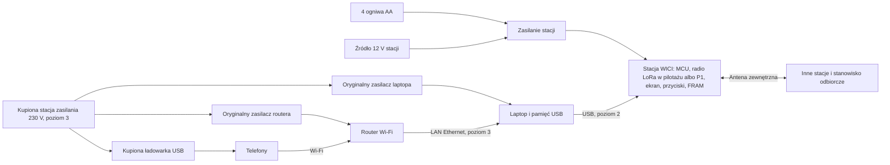

# WICI: projekt stacji

Specyfikacja 0.5 opisuje stację WICI i zestaw poziomów 1–3. Przed pilotażem obowiązuje [stacja pilotażowa](elektronika.md#stacja-pilotażowa) z gotowych modułów; własna płytka R02 (wydanie) jest wstrzymana do decyzji po pilotażu. Próby stosu bez radia LoRa wykonuje się też na stanowisku deweloperskim z płytek rozwojowych ([radio](radio.md#stanowisko-deweloperskie)); kontroler R01.3 wycofano. Instrukcje użycia opisują zestaw, którego jeszcze nie zbudowano.

**Pilotaż i wydanie (przegląd praktyczny 2026-10-08, F99).** Pilotaż używa stacji pilotażowej bez własnej płytki: gotowa płytka MCU (ESP32-S3) z układem LoRa SX1262 i deklaracją zgodności UE, moduł FRAM, ekran Sharp memory LCD na module, przyciski, koszyk na ogniwa AA, wejście 12 V przez gotowy moduł przetwornicy, kupiona obudowa z dławikami i antena zewnętrzna ([elektronika](elektronika.md#stacja-pilotażowa)).

Radio pilotażu to [profil LoRa](radio.md#profil-lora-pilotażu); P1 jest wariantem zapasowym. Pilotaż obejmuje poziom 1 i stanowisko odbiorcze; jego próby wymienia [minimum pilotażu](odbior.md#minimum-pilotażu). Płytka R02, dwa wykonania stacji i poziomy 2–3 należą do zakresu wydania; decyzje o nich zapadają po pilotażu. Poziom 3 używa kupionej stacji zasilania i ładowarki USB z deklaracją UE (D05); opisy własnej przetwornicy 230 V, ładowarki i wejść A/B są w [archiwum elektroniki](elektronika.md#archiwum-własny-blok-zasilania-poziomu-3), bez dalszych prac.

## Zakres

| Parametr | Wartość projektowa |
|---|---|
| Poziomy zestawu | 1: sama stacja; 2: stacja + laptop przez USB; 3: stacja + laptop + router Wi-Fi dla telefonów |
| Mieszkańcy | około 50; jedna stacja obsługuje obiekt niezależnie od liczby osób; strona poziomu 3 sprawdzana dla 15 aktywnych użytkowników jednocześnie; większy obiekt wymaga więcej osób obsługi |
| Sąsiednia stacja | cel: 1 km w zabudowie; wynik wymaga próby terenowej |
| Odbiorca zgłoszeń | stanowisko odbiorcze wyznaczone przez wójta (burmistrza, prezydenta miasta); zwykle jednostka ochotniczej straży pożarnej z grafikiem dyżurów na czas kryzysu, a także gminne centrum zarządzania kryzysowego lub stanowisko gminnego zespołu zarządzania kryzysowego |
| Informacje radiowe | zgłoszenia, odpowiedzi, statusy, komunikaty; bez zdjęć i głosu |
| Uruchomienie stacji | gotowość radiowa ≤60 s od włączenia, bez komputera; przekazywanie ruchu innych stacji zawsze, gdy stacja jest włączona |
| Zasilanie stacji | 4 wymienne ogniwa AA; wejście 12 V (11,5–16 V w pracy): załączenie po podłączeniu źródła ≥12,4 V; odłączenie przy 11,5 V; ponowne załączenie przy ≥12,4 V (w stacji pilotażowej samoczynnie, w R02 ręcznie przyciskiem OK); przełączanie między ogniwami i 12 V bez resetu; stany: [elektronika](elektronika.md#stany-zasilania-12-v) |
| Czas pracy stacji | ≥48 h jako przekaźnik na ogniwach litowych AA; z akumulatorem 12 V 60 Ah: około 1–3 miesięcy, z 7 Ah: 4–10 dni (model: [rozdział 06](../concept/06-wykonalnosc-i-budzet-zasobow.html#energia-stacji-poziomu-1)) |
| Zasilanie poziomu 3 | kupiona przenośna stacja zasilania z wyjściem 230 V i portami USB oraz kupiona ładowarka USB do telefonów, każda z deklaracją zgodności UE (D05; [elektronika](elektronika.md#poziom-3-kupiona-stacja-zasilania)) |
| Dopuszczalne źródła 12 V stacji | akumulator kwasowo-ołowiowy 12 V, akumulator LiFePO4 12,8 V z BMS, wyjście 12 V DC stacji zasilania; 11,5–16 V na złączu stacji |
| Praca przez dobę (poziom 3) | około 1,8 kWh na dobę; stację zasilania ładuje się albo wymienia, nie zakłada się pracy z jednego ładowania |
| Telefony (poziom 3) | ładowarka USB wielu portów z deklaracją UE; liczba portów według liczby osób |

## Połączenie

Stacja jest jedynym węzłem sieci w schronieniu: przechowuje tożsamość i kolejkę zgłoszeń, obsługuje radio i przekazuje ruch innych stacji. Laptop jest panelem: przechowuje dane mieszkańców i stronę, a wiadomości przekazuje stacji przez USB. Router nie uczestniczy w łączności radiowej; zapewnia Wi-Fi, DHCP i połączenie telefonu z laptopem. Radio nie przekazuje stron WWW ani internetu. Poziom 3 można zasilić także z innego sprawdzonego źródła 230 V; stacja zasilania dotyczy tylko laptopa, routera i ładowarki telefonów, nie stacji WICI.

## Zawartość zestawu

Poziom 1, zawsze w zestawie:

1. Stacja WICI w obudowie: radio (w pilotażu LoRa, [profil](radio.md#profil-lora-pilotażu); P1 jako wariant zapasowy), ekran, przyciski, koszyk na 4 ogniwa AA, wyłącznik główny (przycisk), wejście 12 V, gniazdo USB do laptopa i złącze antenowe.
2. Dwa komplety po 4 ogniwa litowe AA: komplet kryzysowy w zamkniętym opakowaniu, otwierany tylko w kryzysie, i komplet ćwiczebny do TEST i przeglądów.
3. Antena zewnętrzna z uchwytem do stałego montażu, przewód koncentryczny o małym tłumieniu (np. LMR-240) o długości według miejsca montażu (do 2 m ≤1 dB; model instalacji stałej przyjmuje 2,5 dB na końcu, dłuższy przewód wymaga nowego bilansu łącza), odgromnik gazowy (GDT) i przepust ścienny; zapasowy dipol z uchwytem do wystawienia przez okno.
4. Przewód zasilania stacji 12 V z bezpiecznikiem 1 A i końcówkami do gniazda zapalniczki oraz zacisków akumulatora.
5. [Karta obsługi stacji](karta.md) w trzech językach ([UK](karta-uk.md), [EN](karta-en.md)) z piktogramami kategorii oraz drukowana [instrukcja opiekuna](instrukcja.md).
6. Odbiornik bateryjny lub z korbką: FM i fale długie 225 kHz (Polskie Radio Program 1), w miarę możliwości DAB+, z zapasem baterii. Alert RCB i aplikacja RSO wymagają sieci komórkowej lub internetu, więc podczas awarii sieci schronienie ich nie odbierze.
7. Para ręcznych radiotelefonów PMR446 jako głosowy kanał zastępczy; kanał i podton zapisane w planie; zasięg w zabudowie zwykle kilkaset metrów, więc służą do łączności z gońcem lub sąsiednim punktem, a ze stanowiskiem odbiorczym tylko po potwierdzeniu zasięgu.
8. Formularze papierowe zgłoszeń ([pola](karta.md)) do wypełniania w dwóch egzemplarzach i papierowy dziennik zmian.

Rozszerzenia poziomów 2–3:

9. Pamięć USB 64 GB z systemem, kompletnymi pakietami START i kluczem szyfrowania bazy laptopa; przewód USB do stacji.
10. Kupiona przenośna stacja zasilania z wyjściem 230 V i jej ładowarką, z deklaracją zgodności UE i instrukcją po polsku (D05).
11. Kupiona ładowarka USB do telefonów z deklaracją zgodności UE.
12. Przewód Ethernet, adapter USB–Ethernet z dołączonymi sterownikami i przejściówka USB-C do laptopa.
13. Przewody ładowania telefonów oraz jednostronicowa instrukcja strony.
14. Bateryjny czujnik tlenku węgla (CO) – obowiązkowa część zestawu poziomu 3.

Laptop, router, ich oryginalne zasilacze i akumulatory pochodzą z miejsca uruchomienia. Adapter USB–Ethernet nie współpracuje z każdym komputerem. Jego kontroler również musi mieć dwa zakwalifikowane wykonania, np. Realtek RTL8153 i ASIX AX88179.

Zestaw stanowiska odbiorczego (dwie stacje w konfiguracji węzła stanowiska, obowiązkowy komputer stanowiska z zapasem, nośnik stanowiska, antena, zasilanie na ≥72 h) opisuje [stanowisko odbiorcze](stanowisko-osp.md#zestaw-stanowiska).

## Przygotowanie przed kryzysem

Osoba utrzymująca system, w porozumieniu z organizatorem sieci (zwykle samorządem gminy), przełącza stację w tryb przygotowania przyciskiem pod plombowaną pokrywą serwisową (pokrywa daje dostęp tylko do tego przycisku; zerwanie plomby i numer nowej zapisuje się w ewidencji) i przez laptop z pakietem START zapisuje w stacji dokładny adres i wejście schronienia (≤64 B w krótkiej postaci), kartę zaufanego odbiorcy z tożsamością główną i zapasową oraz liczbę stacji w sieci, od której zależy okno TEST startowego. Polecenia konfiguracji, eksportu, importu i aktualizacji oprogramowania stacja przyjmuje tylko w tym trybie. Stacja generuje własną tożsamość i nazwę `WICI-xxxxxx` (6 cyfr szesnastkowych skrótu tożsamości) oraz eksportuje przez USB kartę stacji: klucz publiczny, skrót adresu, nazwę, adres schronienia i odcisk do porównania z ekranem. Aplikacja stanowiska importuje kartę stacji (plik lub kod QR) po porównaniu odcisku. Kartę odbiorcy (skróty adresów i klucze publiczne tożsamości głównej i zapasowej odbiorcy) osoba utrzymująca system otrzymuje uzgodnionym kanałem poza radiem; stacja nigdy nie przyjmuje jej przez radio. Szczegóły: model zaufania i kluczy w rozdziale [Oprogramowanie](oprogramowanie.md). Następnie stacja wysyła TEST, a wynik zapisuje się w ewidencji. Hasła panelu dla opiekuna i zastępców generuje się w tym samym przygotowaniu, offline, na pamięci USB zestawu; wkłada się je do numerowanych, zaklejonych kopert przy stacji.

Na poziomie 3 przygotowuje się wcześniej plakat przy stacji: nazwa sieci Wi-Fi, hasło i adres strony, dla routera sprawdzonego na miejscu. Router dostaje rezerwację DHCP dla adresu MAC adaptera USB–Ethernet z zestawu, więc adres z plakatu nie zależy od laptopa. Przy innym routerze obowiązuje kod QR na ekranie laptopa.

Antenę zewnętrzną z przewodem i przepustem montuje się na stałe podczas przygotowania obiektu, za pisemną zgodą zarządcy, w miejscu wskazanym po próbie zasięgu. Montaż wykonuje firma lub osoba z uprawnieniami do prac na wysokości; odgromnik łączy z uziemieniem elektryk z uprawnieniami. Przepust w budowli ochronnej uzgadnia się z zarządcą i komendą powiatową PSP, w obiekcie zabytkowym potrzebna jest zgoda konserwatora, a potrzebę zgłoszenia budowlanego sprawdza się we właściwym urzędzie. Koszt montażu ujmuje się w budżecie wdrożenia. Przewodu nie prowadzi się przez drzwi hermetyczne, gazoszczelne ani przeciwpożarowe. W piwnicy lub garażu podziemnym stację umieszcza się na kondygnacji naziemnej albo stosuje dłuższy przewód o małym tłumieniu z nowym bilansem łącza. Wystawienie anteny przez okno jest procedurą zapasową.

Stacja jest przechowywana w obiekcie, w zamkniętej skrzynce, z kluczem u zarządcy i opiekuna; ogniwa leżą w opakowaniach poza stacją. Komplet kryzysowy pozostaje zamknięty; TEST i przeglądy wykonuje się z kompletu ćwiczebnego albo ze źródła 12 V. Jeśli obiekt nie zapewnia suchego miejsca w 5–30 °C, stacja jest w magazynie organizatora sieci, a plan wskazuje, kto i w jakim czasie ją dostarcza. Magazyn organizatora przechowuje też zapas stacji i ogniw. Opiekun i zastępcy przechodzą szkolenie z obsługi stacji i kurs pierwszej pomocy przed objęciem funkcji.

## Uruchomienie stacji (poziom 1)

Kolejność odpowiada [karcie obsługi](karta.md).

1. Podłącz do stacji przewód anteny zamontowanej na stałe podczas przygotowania. Tylko gdy jej nie ma (procedura zapasowa): wyprowadź zapasowy dipol przez okno i ustaw go pionowo, w miarę możliwości wysoko i z dala od pomieszczenia z ludźmi; nie kładź go przy metalowej framudze ani nie prowadź przewodu przez drzwi hermetyczne, gazoszczelne lub przeciwpożarowe.
2. Włóż ogniwa AA kompletu kryzysowego (+ do znaku +) albo podłącz źródło 12 V.
3. Naciśnij wyłącznik główny i wybierz język na pierwszym ekranie. Radio startuje niezależnie od wyboru języka.
4. Poczekaj na „RADIO WŁĄCZONE” (≤60 s). Od tej chwili stacja przekazuje ruch innych stacji. Potwierdź adres na ekranie „ADRES: [x] – CZY TO TO MIEJSCE? OK = TAK / WSTECZ = NIE”; przy NIE lub braku adresu stacja pokazuje „STACJA NIE MA TWOJEGO ADRESU – UŻYJ FORMULARZA PAPIEROWEGO”.
5. Zatwierdź OK TEST proponowany przez stację; stacja nadaje go z losowym opóźnieniem („TEST ZAPLANOWANY ZA OKOŁO [mm] MIN – NIE WYŁĄCZAJ. WSTECZ = ANULUJ”). Jeżeli komunikat od odbiorcy prosi o wstrzymanie TEST, wybierz TEST → WSTRZYMAJ („TEST WSTRZYMANY PRZEZ ODBIORCĘ”). Poczekaj na „ODBIORCA ZAPISAŁ”, a potem „ODBIORCA PRZECZYTAŁ”. Bez potwierdzenia w 30 min od nadania TEST stacja podaje alarm „BRAK POTWIERDZENIA OD [n] MIN – GONIEC Z FORMULARZEM, JEŚLI DROGA BEZPIECZNA”.

Napis „RADIO WŁĄCZONE” nie oznacza dostępności pomocy. „OSTATNI KONTAKT Z ODBIORCĄ: [czas] TEMU” (w STAN; na ekranie głównym w skrócie) pokazuje czas od ostatniej uwierzytelnionej wiadomości od odbiorcy; brak świeżego kontaktu nie jest awarią.

Zgłoszenie schronienia: wybierz kategorię, liczbę osób, pilność i opcjonalnie gotową frazę, potem potwierdź. Ekran pokazuje „ZAPISANE W STACJI – CZEKA NA WYSŁANIE”, „WYSYŁANIE – PRÓBA [n], NASTĘPNA ZA [m] MIN”, potem „ODBIORCA ZAPISAŁ”, „ODBIORCA PRZECZYTAŁ” i stan od dyżurnego (stan 3 po potwierdzeniu skierowania przez podmiot dysponujący siłami): „POMOC SKIEROWANA (DECYZJA, NIE GODZINA PRZYJAZDU)”, „PRZEKAZANE DALEJ (PSP / POGOTOWIE / POWIAT)”, „ODBIORCA NIE MOŻE TERAZ POMÓC – CZYTAJ ODPOWIEDŹ” albo „ZAMKNIĘTE”, oraz krótki numer zgłoszenia do przekazania telefonicznie lub przez gońca. Przy pilności 2 opiekun równolegle udziela pierwszej pomocy i – gdy droga jest bezpieczna – wysyła gońca do najbliższej jednostki PSP/OSP lub zespołu ratownictwa medycznego. WICI nie zastępuje numeru 112.

## Dołączenie laptopa i routera (poziomy 2–3)

Stacja pracuje dalej przez cały czas dołączania rozszerzeń.

1. Sprawdź na wyświetlaczu stacji zasilania stan naładowania. Włącz jej wyjście 230 V według instrukcji producenta.
2. Podłącz oryginalne zasilacze laptopa i routera oraz ładowarkę USB telefonów do wyjść stacji zasilania.
3. Połącz laptop ze stacją przewodem USB, a na poziomie 3 także z portem LAN routera. Podłącz pamięć USB zestawu.
4. Uruchom START w działającym systemie albo system Linux z pamięci USB na obsługiwanym komputerze PC. Zaloguj się hasłem z koperty; konta są na pamięci USB zestawu. Panel pokazuje adres i kartę odbiorcy odczytane ze stacji.
5. Połącz telefon z główną siecią Wi-Fi routera i otwórz adres z kodu QR wyświetlonego na ekranie laptopa.

Jeżeli router ma nieznane hasło, wyłączony DHCP lub izolację Wi-Fi od LAN, trzeba go skonfigurować w panelu. Wiele routerów domowych obsługuje najwyżej około 32 klientów Wi-Fi lub ma mniejszą pulę DHCP. Kwalifikacja routera obejmuje 50 klientów i pulę co najmniej 60 adresów. Zablokowany router znaleziony na miejscu pozostaje niedostępny: nie resetuj go bez zgody właściciela. Mac z procesorem Apple Silicon nie uruchomi ogólnego obrazu Linuksa, więc pakiet START wymaga na nim sprawnego systemu macOS. Komputer, którego nie da się uruchomić z pamięci USB i który nie ma sprawnego systemu, jest poza zakresem.

## Energia stacji

Stacja załącza wejście 12 V po podłączeniu źródła o napięciu ≥12,4 V i korzysta z niego do spadku do 11,5 V; wtedy odłącza je i pracuje z ogniw AA. Ponowne załączenie 12 V następuje przy napięciu ≥12,4 V: w R02 po przytrzymaniu OK (zatrzask), w stacji pilotażowej samoczynnie (histereza); ekran pokazuje „12 V ODŁĄCZONE – ZA NISKIE NAPIĘCIE. PODŁĄCZ NAŁADOWANE ŹRÓDŁO I PRZYTRZYMAJ OK”, a przytrzymanie OK w stacji pilotażowej niczego nie psuje. Bez ogniw stacja wyłącza się przy 11,5 V i nie włącza się po samej odbudowie napięcia akumulatora ([stany zasilania 12 V](elektronika.md#stany-zasilania-12-v)). Przełączenie nie resetuje stacji. Ekran pokazuje aktywne źródło, napięcie i szacowany czas pracy („OGNIWA: OKOŁO [x] H PRACY”). Przy niskim napięciu ogniw stacja pokazuje „WYMIEŃ OGNIWA W CIĄGU 1 H”, a przed wyłączeniem zapisuje stan („WYŁĄCZANIE – CZEKAJ, ZAPISUJĘ” → „MOŻNA WYJĄĆ OGNIWA”). Tak samo działa wyłączenie przytrzymaniem wyłącznika głównego przez 2 s. W kryzysie stacja pracuje z kompletu kryzysowego; komplet ćwiczebny jest rezerwą tylko przy napięciu powyżej progu z instrukcji. Ogniwa wymienia się przy włączonym źródle 12 V albo po wyłączeniu stacji; kolejka i dług ciszy pozostają w pamięci FRAM. Nie używaj ogniw różnych typów ani różnego stopnia rozładowania w jednym komplecie.

## Energia poziomu 3

Stację zasilania ładuje się albo wymienia na naładowaną, zanim jej wskaźnik pokaże stan krytyczny według instrukcji producenta. Wyczerpanie stacji zasilania wyłącza laptop, router i ładowanie telefonów, ale nie łączność: stacja WICI ma własne zasilanie. Stację zasilania ładuje się z sieci, z panelu słonecznego albo z instalacji pojazdu według instrukcji producenta, poza pomieszczeniem z ludźmi, jeśli producent tego wymaga.

Nie uruchamiaj silnika pojazdu ani agregatu w schronieniu, w garażu, przy wejściu ani przy wlotach powietrza: tlenek węgla zabija bez ostrzeżenia. Pojazd lub agregat ładujący stację zasilania stoi na zewnątrz, kilka metrów od wejść i wlotów powietrza; przewód nie może utrzymywać otwartych drzwi. Bateryjny czujnik CO z zestawu poziomu 3 umieszcza się w pomieszczeniu z ludźmi. Nie łącz plusów akumulatorów bezpośrednio i nie używaj źródła 24 V do wejścia 12 V stacji WICI.

## Przechowywanie i przeglądy

Zestaw może czekać na użycie latami. Przechowuje się go w obiekcie, w zamkniętej skrzynce, w suchym miejscu w 5–30 °C, bez akumulatorów podłączonych do wejść i z ogniwami AA poza stacją. Komplet kryzysowy wymienia się w dacie ważności z opakowania, nie rzadziej niż co 10 lat; komplet ćwiczebny, gdy jego napięcie spadnie poniżej progu z instrukcji.

Co kwartał opiekun wykonuje przegląd podstawowy z kompletu ćwiczebnego albo ze źródła 12 V: uruchomienie, TEST, napięcie ogniw ćwiczebnych, nienaruszone opakowanie kompletu kryzysowego, aktualność karty. Raz w roku osoba kompetentna (serwis, krótkofalowiec, wyznaczony pracownik) wykonuje przegląd techniczny; nowe wydanie oprogramowania instaluje się tylko podczas tego przeglądu:

1. Uruchom stację z kompletu ćwiczebnego albo ze źródła 12 V; sprawdź na ekranie adres, kartę odbiorcy i nazwę `WICI-xxxxxx`. Sprawdź datę ważności kompletu kryzysowego bez otwierania opakowania i napięcie kompletu ćwiczebnego; wymień ogniwa przeterminowane albo o napięciu niższym niż podane w [instrukcji](instrukcja.md#energia-stacji) (komplet ćwiczebny: „OGNIWA: [x] V” w STAN co najmniej 5,6 V po minucie pracy).
2. Sprawdź sumy kontrolne obrazu na pamięci USB, bo pamięć flash bez zasilania traci dane. Wymień ją co kilka lat albo przechowuj drugą, sprawdzoną kopię.
3. Uruchom aplikację z przygotowanego zestawu na aktualnych komputerach z lokalnej listy; nowe wersje systemów mogą wymagać nowego pakietu START.
4. W wykonaniu z P1 (wariant zapasowy) w każdym corocznym przeglądzie zmierz i skoryguj częstotliwość nadajnika, aby skontrolować starzenie TCXO ([radio](radio.md)); pomiar wykonuje producent lub serwis przyrządem o dokładności ≤0,1 ppm, a stacje dowozi się w tym dniu do jednego miejsca (około 20 min na stację). W LoRa wystarcza wymiana ramek z sąsiednią stacją w TEST; przy dwóch wykonaniach sprawdź wymianę ramek ze stacją drugiego wykonania. Do oceny: ekran pokazuje odchyłkę częstotliwości oszacowaną z odebranych ramek jako tanią samokontrolę między przeglądami.
5. Sprawdź stację zasilania poziomu 3 według instrukcji producenta: naładowanie do poziomu przechowywania, pracę pod obciążeniem laptopa i routera, datę wymiany akumulatora.
6. Zaktualizuj oprogramowanie stacji, jeśli jest nowe wydanie: podpisany obraz przez USB z laptopa z pakietem START, w trybie przygotowania (przycisk pod plombowaną pokrywą serwisową, bez otwierania obudowy głównej); najpierw na jednej stacji z TEST, potem na pozostałych. Po zakończeniu załóż nową plombę na pokrywę serwisową i wpisz jej numer do ewidencji; nienaruszoną plombę sprawdza opiekun w przeglądzie kwartalnym.
7. Wyślij TEST do odbiorcy i sprawdź aktualność karty zaufanego odbiorcy.
8. Obejrzyj antenę, przewód, uszczelnienia złączy i odgromnik; przy śladach wilgoci lub uszkodzeniu wymień element i zmierz WFS (≤2), jak przy montażu ([radio](radio.md#dwa-wykonania)).

Wynik przeglądu zapisuje się z datą i wersją wydania w ewidencji sprzętu gminy. TEST z każdej stacji wysyła się raz w miesiącu w ustalonym, rozłożonym oknie czasowym; ćwiczenie całej sieci ze stanowiskiem odbiorczym i gońcem odbywa się raz w roku w ramach ćwiczeń zarządzania kryzysowego ([koncepcja, rozdział 02](../concept/02-scenariusze-i-organizacja.html#instrukcja-i-cwiczenie)).

## Rozstrzygnięcia

| Wybór | Uzasadnienie i koszt |
|---|---|
| Samodzielna stacja; laptop i router jako rozszerzenia | Łączność i przekaźnik bez znalezionego sprzętu i bez 230 V; oprogramowanie układowe stosu, kolejki i interfejsu na MCU |
| Stacja jedynym węzłem schronienia, laptop bez tożsamości Reticulum | Jedna tożsamość i jedna kolejka; potrzebny protokół USB laptop–stacja (D17) |
| Tożsamość odbiorcy i stos LXMF na komputerze stanowiska, stacja stanowiska jako węzeł transportu (D19) | Dojrzały stos i pamięć bez stałych limitów w najbardziej obciążonym węźle, jedna rola stacji; komputer stanowiska obowiązkowy, z zapasem; interfejs Reticulum przez USB w stacji |
| microReticulum i LXMF na MCU | Gotowy stos zamiast własnego; młodszy projekt, zgodność do sprawdzenia w T3 |
| Ogniwa AA i wejście 12 V | Start bez ładowania i lata przechowywania; koszt ogniw i kontrola w przeglądzie |
| LXMF nad Reticulum | Gotowe dostarczanie wiadomości; stacja nadal odpowiada za trwały zapis, a stanowisko odbiorcze za decyzję |
| Mała własna strona HTTP | Telefon używa zwykłej przeglądarki; NomadNet nie jest takim interfejsem |
| Stacja pilotażowa z gotowych modułów (F99) | Pilotaż bez własnej płytki, toru RF i bloku zasilania; większa obudowa, więcej połączeń przewodowych, wyniki nie przenoszą się automatycznie na R02 |
| Profil LoRa SF7 w pilotażu (D10) | Gotowe moduły z deklaracją UE i lepsza czułość niż P1; kanał współdzielony z LoRaWAN RX2 i Meshtastic (D11) |
| Kupiona stacja zasilania poziomu 3 (D05) | Wyrób z deklaracją UE zamiast własnej przetwornicy 230 V i ładowarki; koszt zakupu i zależność od producenta |
| Standardowy JSON w LXMF | Prosty format w stacji i laptopie; treść ≤256 B po kodowaniu, jeden pakiet okazjonalny (roboczo, do potwierdzenia w D01 i T3) |

Rolę NomadNet opisuje rozdział [Oprogramowanie](oprogramowanie.md). Nie wolno uruchamiać dwóch stacji z tą samą tożsamością ani routera LXMF na laptopie z tożsamością stacji. Router LXMF z tożsamością odbiorcy działa tylko na komputerze stanowiska. Węzeł przechowywania LXMF na stanowisku nie należy do wydania 0.5: mógłby być przyszłą funkcją aplikacji stanowiska po osobnych próbach. W sieci podstawowej ruch przechodzi przez aktywne przekaźniki. [NomadNet](https://github.com/markqvist/NomadNet), [LXMF](https://github.com/markqvist/LXMF).
