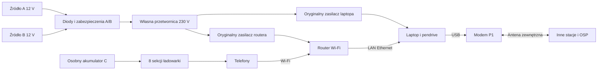

# WICI — projekt stacji

## Zakres

| Parametr | Wartość projektowa |
|---|---|
| Mieszkańcy | około 50, 15 aktywnych użytkowników strony jednocześnie |
| Sąsiednia stacja | cel: 1 km w zabudowie; wynik wymaga próby terenowej |
| Informacje radiowe | zgłoszenia, odpowiedzi, statusy, komunikaty; bez zdjęć i głosu |
| Zasilanie | 12 V; źródła A/B dla stacji, osobne C dla telefonów |
| Ciągłość | nowy akumulator podłączony przed odłączeniem starego |
| Praca przez dobę | kolejne źródła z lokalnych zasobów; nie zakłada się pracy z jednego akumulatora |
| Przetwornica | cel: 150 W mocy ciągłej, 230 V ±5%, 50 Hz, THD <5% |
| Gniazdo zapalniczki | profil do 8 A prądu wejściowego; może ograniczyć moc AC do około 70 W |
| Telefony | 8 niezależnych portów USB-A, 5 V / 1,5 A, 60 W łącznie |

## Połączenie

Router nie uczestniczy w łączności radiowej. Zapewnia Wi-Fi, DHCP i połączenie telefonu z laptopem. Radio nie przekazuje stron WWW ani internetu. Laptop przechowuje zgłoszenia, obsługuje radio i przekazuje ruch innych stacji.

## Zawartość zestawu

1. Modem USB, dipol, przewód koncentryczny do 2 m i uchwyt do wyprowadzenia anteny przez okno lub drzwi.
2. Pendrive 64 GB z systemem i kompletnymi pakietami START.
3. Zespół zasilania stacji: dwa wejścia A/B i przetwornica, przewody do gniazda zapalniczki oraz do zacisków akumulatora, bezpieczniki przy źródłach.
4. Osobna ładowarka 8 portów i jej przewód akumulatorowy.
5. Przewód Ethernet, przewód USB do modemu, adapter USB–Ethernet z dołączonymi sterownikami i przejściówka USB-C do laptopa.
6. Przewody ładowania telefonów oraz jednostronicowa instrukcja.

Laptop, router, ich oryginalne zasilacze i akumulatory pochodzą z miejsca uruchomienia. Adapter sieciowy nie zapewnia obsługi każdego komputera; jego kontroler również musi mieć dwa zakwalifikowane wykonania, np. Realtek RTL8153 i ASIX AX88179.

## Uruchomienie odebranego zestawu

1. Wyprowadź antenę na zewnątrz i ustaw pionowo. Nie kładź jej przy metalowej framudze.
2. Podłącz źródło A do zasilania stacji i źródło C do ładowarki.
3. Podłącz oryginalne zasilacze laptopa i routera do wyjść przetwornicy.
4. Połącz laptop z portem LAN routera i modemem USB. Podłącz pendrive.
5. Uruchom START w działającym systemie albo system Linux z pamięci USB na obsługiwanym komputerze PC.
6. Wpisz dokładny adres schronienia, ustaw hasło opiekuna i zaimportuj kartę zaufanej OSP.
7. Połącz telefon z główną siecią Wi-Fi routera i otwórz adres z kodu QR wyświetlonego na ekranie laptopa.
8. Wyślij TEST z adresem schronienia. Poczekaj na RECEIVED, czyli zapis w OSP, a potem na STATUS „przeczytane” od dyżurnego. Zielony wskaźnik USB nie oznacza dostępności pomocy.

Jeżeli router ma nieznane hasło, wyłączony DHCP lub izolację Wi-Fi od LAN, potrzebna jest konfiguracja jego panelu. Znaleziony, zablokowany router nie staje się przez to dostępny. Nie resetuj znalezionego urządzenia bez zgody właściciela. Mac z procesorem Apple Silicon nie uruchomi naszego ogólnego obrazu Linuksa; pakiet START wymaga na nim sprawnego systemu macOS. Komputer, którego nie da się uruchomić z pamięci USB i który nie ma sprawnego systemu, jest poza zakresem.

## Wymiana źródła

Podłącz nowe źródło do wolnego wejścia. Sprawdź działanie stacji pod pełnym obciążeniem po odłączeniu starego. Nie odłączaj obu naraz. Ustawiony limit 8 A lub 20 A musi pasować do każdego źródła, które może przejąć zasilanie. Nie wolno przełączyć na 20 A tylko dlatego, że jedno z dwóch wejść ma mocniejszy przewód.

Wymiana źródła C może przerwać ładowanie telefonów, lecz nie łączność. Nie łącz plusów akumulatorów bezpośrednio. Nie używaj źródła 24 V. Podstawowy wariant nie jest dopuszczony do pracy podczas rozruchu silnika.

## Rozstrzygnięcia

| Wybór | Uzasadnienie i koszt |
|---|---|
| LXMF nad Reticulum | Gotowe dostarczanie wiadomości; aplikacja nadal odpowiada za trwały zapis i decyzję OSP |
| Mała własna strona HTTP | Telefon używa zwykłej przeglądarki; NomadNet nie jest takim interfejsem |
| 8 pojedynczych sekcji ładowania | Uszkodzenie jednej przetwornicy obniżającej wyłącza tylko jeden port; więcej dławików, prostsze naprawy |
| Pasywne diody A/B | Bez kodu i sterowania; strata energii oraz konieczne chłodzenie |
| Mostek niskiego napięcia i transformator 50 Hz | Mniej stopni mocy; większa masa i możliwy większy koszt |
| Krótkie ramki radiowe | Mieszczą się w kolejce FIFO obu układów; dodatkowy narzut fragmentacji |
| Standardowy JSON w LXMF | Kodowanie z biblioteki standardowej; treść do 480 B |

NomadNet jest opcjonalnym klientem opiekuna lub dyżurnego, z osobną tożsamością. Nie uruchamiamy dwóch routerów LXMF obsługujących tę samą tożsamość stacji. Węzeł przechowywania LXMF w OSP jest opcjonalny; w sieci podstawowej ruch przechodzi przez aktywne przekaźniki. [NomadNet](https://github.com/markqvist/NomadNet), [LXMF](https://github.com/markqvist/LXMF).
