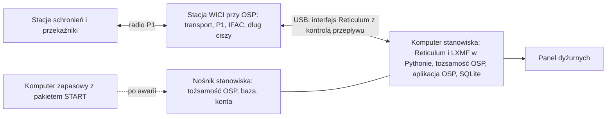

# WICI: stanowisko odbiorcze (OSP)

Dokument opisuje stanowisko, które przyjmuje zgłoszenia schronień, i porównuje sposoby jego budowy. Skrót OSP oznacza rolę stanowiska odbiorczego wyznaczonego przez wójta (burmistrza, prezydenta miasta), a nie konkretną jednostkę ([koncepcja, rozdział 02](../concept/02-scenariusze-i-organizacja.html#miejsce-w-systemie-ochrony-ludnosci)). Pozostałe rozdziały specyfikacji opisują przede wszystkim stację w schronieniu. Wymagania dotyczące OSP są w nich rozproszone, a tutaj zebrano je w jednym miejscu.

Stan: propozycja z 2026-10-08 do decyzji D19 ([plan weryfikacji](../concept/08-plan-weryfikacji-i-decyzje.html)). Do czasu decyzji obowiązuje opis z rozdziałów [Oprogramowanie](oprogramowanie.md#stanowisko-dyżurnego-osp) i [Projekt](projekt.md#zawartość-zestawu), czyli wariant A poniżej. Żadna część stanowiska nie jest zbudowana. Oprogramowanie układowe ma tylko szkic roli OSP, jeszcze bez uruchomienia na sprzęcie.

## Czym stanowisko różni się od schronienia

| | Stacja w schronieniu | Stanowisko OSP |
|---|---|---|
| Obsługa | opiekun i zastępcy po krótkim szkoleniu; karta i przyciski | dyżurni po szkoleniu (4 h i ćwiczenie T8), grafik co najmniej 4 osób, konta i dziennik działań |
| Miejsce | obiekt bez prądu, często piwnica; stacja w skrzynce, wyjmowana w kryzysie | stały punkt z agregatem lub stacją zasilania na ≥72 h, antena w najwyższym punkcie budynku |
| Zasilanie | ogniwa AA przez ≥48 h, akumulator 12 V | stałe 12 V lub 230 V z rezerwą; pobór stacji i komputera nie jest ograniczeniem |
| Ruch | własne zgłoszenia i przekazywanie ruchu sąsiadów | każde zgłoszenie z sieci; najbardziej obciążony węzeł (model: ok. 121 zgłoszeń/h, przekaźnik przed OSP ok. 68/h) |
| Stan do przechowania | kolejka do 128 intencji, skrzynka do 128 wiadomości | wszystkie zgłoszenia zdarzenia, rewizje, statusy, klucze odbioru, kwarantanna, karty ≥256 stacji, dziennik decyzji |
| Bezpieczeństwo | jeden klucz stacji; karta OSP | klucz, któremu ufa cała sieć; tożsamość zapasowa; dodawanie i unieważnianie stacji |
| Dane osobowe | mało, bez nazwisk | całość zdarzenia; administrator danych, umowa powierzenia, archiwum przy ZAMKNIJ ZDARZENIE |
| Drugi kanał | goniec, PMR446 | telefon lub radio służb, PMR446 z nasłuchem, łącze do powiatu |
| Komputer | opcjonalny (poziomy 2–3) | w każdym wariancie potrzebny do przyjmowania zgłoszeń (niżej) |

Wymagania, które kształtują stację w schronieniu (ogniwa AA, start ≤60 s bez komputera, ekran 5 × 20 znaków, niski koszt serii), w OSP prawie nie mają znaczenia. Wymagania OSP (pojemność pamięci, liczba tras i kart, ruch całej sieci) w obecnej specyfikacji obciążają jednak każdą stację, bo stacja zapasowa OSP i wymiana stacji między rolami wymagają jednego wykonania ([pamięć FRAM według roli](oprogramowanie.md#trwałość-i-potwierdzenia)).

## Wymagania stanowiska

| ID | Wymaganie | Źródło | Sprawdzenie |
|---|---|---|---|
| O01 | RECEIVED dopiero po zatwierdzeniu zapisu (COMMIT) zgłoszenia, tożsamości nadawcy, klucza odbioru i intencji RECEIVED w jednej transakcji | [trwałość](oprogramowanie.md#trwałość-i-potwierdzenia) | model, T2 |
| O02 | Deduplikacja po kluczu odbioru (nadawca, id, revision); ten sam klucz z inną treścią to konflikt bez nadpisania; powtórzony REQUEST dostaje ten sam RECEIVED i najnowszy STATUS | trwałość | model, T2 |
| O03 | Zaufanie: karty stacji z pełnym kluczem, kwarantanna nieznanych nadawców bez RECEIVED (≤4 wiadomości na nadawcę, ≤256 łącznie), unieważnienie stacji z alarmem „możliwe przejęcie stacji”; dodanie zaufanej stacji za zgodą dwóch osób | [model zaufania](oprogramowanie.md#model-zaufania-i-kluczy) | model, T2, T8 |
| O04 | Panel dyżurnego: kolejka według pilności i czasu odbioru, alarm dźwiękowy przy pilności 2, PRZECZYTANE jednym przyciskiem, TEST osobno, stan 5 tylko z REPLY, kwarantanna, BULLETIN z postępem rozsyłania | [stanowisko dyżurnego](oprogramowanie.md#stanowisko-dyżurnego-osp) | T1, T8 |
| O05 | Osobne konta dyżurnych, blokada ekranu po 5 min, dziennik działań tylko do dopisywania, przekazanie zmiany z listą otwartych zgłoszeń | stanowisko dyżurnego | T8 |
| O06 | Brak sztucznego limitu przyjęć poniżej pojemności radiowej: stanowisko przyjmuje co najmniej cały ruch, jaki może do niego dotrzeć (121 zgłoszeń/h przez 72 h, ok. 8700 zgłoszeń), bez odrzucania z powodu pełnej pamięci | [pojemność](oprogramowanie.md#wiadomości-sa1), rozdział 06 | T5, próba obciążenia |
| O07 | Przy awarii komputera stanowisko wraca do przyjmowania zgłoszeń w ≤15 min bez utraty przyjętych zgłoszeń i kluczy odbioru (wartość robocza) | ta propozycja | T2, T8 |
| O08 | Przekazywanie ruchu innych stacji przy stanowisku nie zależy od komputera | ta propozycja | T5 |
| O09 | Zasilanie stacji i komputera na ≥72 h; zmiana źródła bez przerwy pracy | [projekt](projekt.md#zawartość-zestawu) | T6 |
| O10 | Klucz OSP i baza zaszyfrowane w spoczynku; komputer bez internetu i samoczynnych aktualizacji; tożsamość zapasowa w zaplombowanej kopercie poza stanowiskiem | model zaufania, D08 | T2 |
| O11 | Zapisywane dane: SA1, adres nadawcy, czas odbioru, klucze odbioru, dziennik działań; bez IP, MAC, telefonów i nazwisk; ZAMKNIJ ZDARZENIE z archiwum dla administratora | [dane osobowe](oprogramowanie.md#model-zaufania-i-kluczy), D13 | T2, T8 |
| O12 | Ogłoszenie adresu OSP co 6 h ±20% i po restarcie; BULLETIN osobno do każdej stacji w granicach czasu nadawania P1 | [tryby kryzysowe](oprogramowanie.md#tryby-kryzysowe) | T5 |

## Co dziś działa bez komputera

Według obecnej specyfikacji stanowisko OSP to stacja WICI w roli OSP i stały laptop z aplikacją OSP. Stacja trzyma tożsamość OSP, karty zaufanych stacji i kolejkę `incoming` w FRAM. Laptop trzyma bazę SQLite, a RECEIVED wysyła dopiero po COMMIT w SQLite ([protokół USB](oprogramowanie.md#protokół-usb-laptopstacja)).

| Czynność | Bez laptopa OSP |
|---|---|
| przekazywanie ruchu innych stacji | działa |
| odbiór i weryfikacja zgłoszeń | działa; zgłoszenia czekają w `incoming` w FRAM (128 miejsc, w tym ≤16 dla nieznanych nadawców) |
| RECEIVED do schronienia | **nie działa**; schronienie widzi brak potwierdzenia i po czasie zależnym od pilności dostaje alarm „wyślij gońca” |
| odczyt zgłoszenia przez dyżurnego | nie działa; ekran stacji pokazuje tylko liczbę oczekujących (`incoming_osp`) |
| STATUS, REPLY, BULLETIN | nie działa |
| po zapełnieniu `incoming` | stacja przestaje przyjmować zgłoszenia; przy 121/h to około godziny |

**Wniosek:** obecny projekt nie gwarantuje przyjmowania zgłoszeń bez komputera. Gwarantuje tylko, że sieć przekazuje ruch i że zgłoszenia nie giną. Czekają jednak w kolejkach schronień, które je ponawiają, a nie w stacji OSP. Dla schronienia oba przypadki wyglądają tak samo: brak „ODBIORCA ZAPISAŁ”, alarm, goniec. Bufor `incoming` w stacji OSP skraca tylko czas dotarcia zgłoszeń po powrocie laptopa.

## Warianty

### A. Stacja w roli OSP i obowiązkowy komputer (stan obecny)

Jak dziś, ale z jawnym wymaganiem komputera i jego zapasu. Stos sieciowy z tożsamością OSP działa na mikrokontrolerze stacji, a aplikacja OSP na komputerze.

### B. Stacja w roli OSP z trybem awaryjnym bez komputera

Wariant A, w którym stacja OSP przy braku komputera sama zatwierdza przyjęcie w FRAM i wysyła RECEIVED. Dyżurny czyta zgłoszenia na ekranie 5 × 20 znaków i przyciskami wysyła PRZECZYTANE oraz stany 3, 4 i 6. Po powrocie komputera stacja przekazuje mu przyjęte zgłoszenia i decyzje.

### C. Węzeł OSP na komputerze, stacja przy OSP jako węzeł transportu

Komputer stanowiska uruchamia Reticulum i LXMF w Pythonie (implementację wzorcową, przypiętą jak w stacji: Reticulum `e40191b`, LXMF `c3ff2d6`), tożsamość OSP i aplikację OSP z SQLite. Stacja WICI przy OSP jest zwykłą stacją z tym samym oprogramowaniem co w schronieniu. Pracuje jako węzeł transportu z drugim interfejsem Reticulum przez USB, obok interfejsu P1. Nie ma tożsamości OSP, kart zaufanych stacji ani kolejki `incoming`.

Limity radiowe (czas nadawania, dług ciszy, limit ogłoszeń 2%, IFAC) zostają w stacji, więc komputer nie może ich przekroczyć. Interfejs USB przenosi pakiety Reticulum w ramkach KISS albo HDLC, jak interfejsy szeregowe Reticulum. Stacja zgłasza gotowość na następny pakiet podobnie jak RNode z kontrolą przepływu. Schronienia nie widzą zmiany: tożsamość, adres LXMF, karta OSP, SA1, RECEIVED i ODBIORCA ZAPASOWY działają jak dotąd.

## Porównanie

| Kryterium | A | B | C |
|---|---|---|---|
| Przyjmowanie zgłoszeń bez komputera | nie | tak, ale tylko przy małym ruchu (niżej) | nie |
| Przekazywanie ruchu bez komputera | tak | tak | tak |
| Użyteczność dla dyżurnego | panel na komputerze | panel; bez komputera ekran 5 × 20, bez REPLY z własnym tekstem i bez zarządzania zaufaniem | panel na komputerze |
| Ryzyko „zapchania” | `incoming` 128, kolejka ≥512 intencji, ≥256 tras i kart w MCU i FRAM; limity stałe | jak A, a przyjęte bez komputera zgłoszenia też zajmują FRAM | ograniczenie tylko czasem nadawania; pamięć i dysk praktycznie bez limitu (O06) |
| Dojrzałość stosu w najbardziej obciążonym węźle | microReticulum na MCU, zgodność do sprawdzenia w T3 | jak A | implementacja wzorcowa Reticulum i LXMF |
| RAM MCU | rola OSP najcięższa; już obraz stacji ma w szczycie 4,9% wolnej RAM wobec progu 30% ([pomiar](../../firmware/README.md#pamięć-ram)) | jak A, plus interfejs przeglądania | stacja przy OSP jak każdy przekaźnik przed OSP |
| Wpływ na stację w schronieniu | FRAM 4 Mbit we wszystkich stacjach z powodu roli OSP (≈403 KiB); kod roli OSP w każdym obrazie i w obu wykonaniach | jak A, plus kod trybu awaryjnego i synchronizacji | jedna rola; FRAM i RAM liczone tylko dla stacji i przekaźnika; nowy interfejs USB Reticulum (dla stacji w schronieniu wyłączony) |
| Zakres oprogramowania układowego | rola OSP: `incoming`, karty, `trust`, `revoke`, BULLETIN z mapą odbiorców | jak A, plus menu dyżurnego i uzgadnianie dwóch magazynów | mniej: bez roli OSP; dochodzi interfejs USB z kontrolą przepływu |
| Oprogramowanie komputera | aplikacja OSP bez stosu | jak A, plus synchronizacja | aplikacja OSP ze stosem; logikę przyjęcia ma już model `OSPStore` w [modelu wzorcowym](../../software/reference/README.md) |
| Bezpieczeństwo | klucz OSP w stacji; przejęty laptop może wysyłać STATUS, REPLY i BULLETIN przez `submit`, ale nie wykradnie klucza; dodanie zaufanej stacji wymaga przycisku na stacji | jak A | klucz OSP na komputerze; przejęty komputer ujawnia klucz, więc potrzebna tożsamość zapasowa (już jest), szyfrowanie nośnika i komputer bez sieci; zgoda dwóch osób bez przycisku na stacji |
| Zapas sprzętu | stacja zapasowa OSP | stacja zapasowa OSP | dowolna stacja WICI i drugi komputer z pakietem START |
| Najważniejsza niewiadoma | czy microReticulum w roli OSP zmieści się i wytrzyma obciążenie (T3, T5) | jak A, plus poprawność uzgadniania dwóch magazynów | czy Reticulum w Pythonie za interfejsem USB dobrze liczy czasy oczekiwania dla P1 (T3) |

**Tryb awaryjny B przy realnym ruchu.** Jedno zgłoszenie z adresem, kategorią, liczbą osób, pilnością i frazą zajmuje 2–3 ekrany. Przy kilkudziesięciu zgłoszeniach na godzinę dyżurny bez komputera nie nadąża ich czytać, a przekazanie dalej i tak wymaga papierowego dziennika. Przyjęcie bez komputera oznacza dwa źródła prawdy (FRAM stacji i SQLite) i ich późniejsze uzgadnianie: konflikty rewizji, statusy wysłane z obu miejsc, klucze odbioru. Właśnie tego projekt unikał, wybierając jeden zapis i jednego właściciela zapisu. Tryb B ma sens tylko przy kilku zgłoszeniach na godzinę, na przykład w przenośnym stanowisku zastępczym.

**Czego żaden wariant nie zmienia.** Pojemność sieci ogranicza czas nadawania na jedynym kanale P1, a nie komputer ani pamięć. Około 121 zgłoszeń/h w OSP i 68/h na przekaźniku przed OSP to limity wszystkich wariantów. Podnosi je tylko drugi odbiorca albo podział sieci.

## Rekomendacja

**Wariant C.** W stanowisku OSP komputer jest obowiązkowy, bo przyjmowanie zgłoszeń wymaga go w każdym wariancie poza B, a B daje gwarancję tylko przy małym ruchu i za cenę dwóch magazynów. Gwarancją pracy bez jednego komputera jest zapas: drugi przygotowany komputer i nośnik stanowiska. Tryb pracy bez komputera nie daje takiej gwarancji.

Uzasadnienie:

1. **Działanie bez komputera.** C zachowuje to, co A naprawdę gwarantuje dziś: sieć przekazuje ruch, a zgłoszenia czekają w schronieniach (O08). Bufor `incoming` w stacji OSP odpada, ale nie skracał on drogi do „ODBIORCA ZAPISAŁ”.
2. **Stabilność i zapychanie.** Najbardziej obciążony węzeł dostaje dojrzałą implementację i praktycznie nieograniczoną pamięć. Znikają stałe limity `incoming`, kolejki OSP i magazynu kart, które przy dłuższej nieobecności komputera lub dyżurnego zapełniały się w ciągu godziny.
3. **Koszt stacji w schronieniu.** Stacja ma jedną rolę. Budżet RAM i FRAM liczy się dla stacji i przekaźnika, a nie dla OSP. Obniża to ryzyko, że D14 wymusi droższy MCU we wszystkich stacjach z powodu jednego węzła na gminę. Zmniejszenie FRAM do 2 Mbit nie wynika z tego automatycznie: w roli stacji 2 Mbit byłyby zajęte w 80%, więc trzeba to policzyć ponownie.
4. **Mniej pracy przy MCU.** Z oprogramowania układowego znika rola OSP. Dochodzi interfejs USB Reticulum, prostszy od roli OSP i przydatny też w laboratorium do prób zgodności (T3).
5. **Koszt na stanowisko.** Drugi komputer na gminę kosztuje mniej niż dodatkowe części lub mocniejszy MCU w każdej stacji sieci.

Warunki i koszty:

- **T3 przed przyjęciem C:** Reticulum i LXMF w Pythonie za stacją WICI po USB. Limity potwierdzeń i ponowień muszą uwzględniać dług ciszy P1, a nie szybkość USB. Dziś nadawca w Pythonie wymaga ręcznie ustawionego limitu 120 s ([próba zgodności](../../firmware/README.md#próba-zgodności-z-reticulum)). Trzeba to rozwiązać konfiguracją interfejsu, a nie łatą stosu wzorcowego. Jeśli wymagałoby to głębokich zmian w Reticulum, wraca wariant A z jawnie obowiązkowym komputerem.
- **Zaufanie bez przycisku na stacji:** dodanie i unieważnienie stacji zatwierdzają dwie zalogowane osoby, z porównaniem odcisku z kartą w ewidencji. Komputer nie ma interfejsu sieciowego poza USB do stacji. Zagrożenie „przejęty komputer stanowiska” trzeba dopisać do [rozdziału 07](../concept/07-zagrozenia-i-odpornosc.html) z ograniczeniem przez tożsamość zapasową.
- **Licencja:** komputer OSP uruchamia kod Reticulum i LXMF, więc pakiet stanowiska podlega ich licencjom tak jak pakiet START (F08).
- **Tryb B nie wchodzi do wydania.** Może wrócić jako przenośne stanowisko zastępcze, jeśli T8 pokaże taką potrzebę.

## Zestaw stanowiska (wariant C)

1. Dwie stacje WICI w konfiguracji „węzeł OSP” (transport, interfejs USB Reticulum, bez adresu schronienia i bez TEST startowego). Zapasową może być dowolna stacja przełączona w trybie przygotowania.
2. Stały komputer stanowiska (laptop, bo wbudowany akumulator działa jak zasilacz awaryjny) z pakietem stanowiska, pełnym szyfrowaniem dysku, bez usypiania, samoczynnych aktualizacji i sieci.
3. Drugi, przygotowany komputer tego samego typu, sprawdzany w przeglądzie kwartalnym.
4. Nośnik stanowiska: zaszyfrowany dysk USB z tożsamością OSP, bazą SQLite i plikiem kont. Przy awarii komputera przekłada się go do zapasowego. Wybór nośnika i jego trwałość przy zaniku zasilania sprawdza T2. Kopia zapasowa bazy jest częścią przekazania zmiany.
5. Antena kolinearna w najwyższym dostępnym punkcie budynku, z odgromnikiem, z dala od stanowiska kierowania ([rozdział 07](../concept/07-zagrozenia-i-odpornosc.html)).
6. Zasilanie stacji i komputerów na ≥72 h: agregat lub stacja zasilania z deklaracją zgodności UE.
7. Papierowy dziennik zgłoszeń i decyzji, formularze do przekazania zgłoszeń służbom.
8. Para radiotelefonów PMR446 z nasłuchem w ustalonych godzinach; łącze satelitarne do powiatu, jeśli jest dostępne.
9. Grafik co najmniej 4 dyżurnych.

## Działanie przy awarii (wariant C)

| Awaria | Skutek | Postępowanie |
|---|---|---|
| komputer | brak przyjęć i decyzji; sieć przekazuje ruch; schronienia ponawiają zgłoszenia | nośnik do komputera zapasowego (O07); po starcie OSP ogłasza adres, a ponowienia schronień dostarczają zaległe zgłoszenia; deduplikacja nie przyjmie ich dwa razy |
| stacja przy OSP | brak łączności radiowej stanowiska | stacja zapasowa w tym samym gnieździe anteny i USB; tożsamość OSP się nie zmienia, bo jest na komputerze |
| nośnik stanowiska | utrata bazy; tożsamość OSP z kopii | kopia bazy z przekazania zmiany; zgłoszenia przyjęte po kopii schronienia mogą wysłać ponownie, bo trzymają intencje do RECEIVED |
| przejęcie komputera lub nośnika | klucz OSP ujawniony | tożsamość zapasowa z koperty na komputerze zapasowym; schronienia przełączają się na polecenie słowne lub gońca (ODBIORCA ZAPASOWY) |
| zasilanie | jak komputer, po wyczerpaniu akumulatora laptopa | zmiana źródła bez przerwy (O09) |
| brak dyżurnego | RECEIVED działa, PRZECZYTANE nie; schronienia przy pilności 2 dostają alarm `brak_odczytu` | grafik; PMR i goniec |

## Skutki dla innych dokumentów

Po decyzji D19 na korzyść C trzeba zmienić:

- [Oprogramowanie](oprogramowanie.md): usunąć rolę OSP ze stacji (`incoming`, karty zaufanych stacji w FRAM, `trust`, `revoke`, kolumna „Rola OSP” w tabeli FRAM, tekst `incoming_osp`, typy `submit` dla OSP); dodać konfigurację „węzeł OSP” i interfejs USB Reticulum; opisać aplikację OSP ze stosem i jej zaufanie.
- [Radio](radio.md): interfejs USB w stosie obok interfejsu P1; kontrola przepływu i czasy oczekiwania.
- [Projekt](projekt.md): zestaw stanowiska OSP zastąpić odnośnikiem do tego dokumentu; w rozstrzygnięciach rozdzielić zasadę „stacja jedynym węzłem” dla schronienia i dla OSP.
- [BOM stacji](bom-stacji.csv): uzasadnienie FRAM bez roli OSP; ponowne przeliczenie, czy 2 Mbit wystarcza w roli stacji.
- [Odbiór](odbior.md): próby O01–O12, w tym zmiana komputera w ≤15 min (T2, T8) i obciążenie stanowiska (T5).
- Koncepcja: rozdział 02 (zestaw stanowiska), 05 (schemat: komputer OSP jako węzeł Reticulum), 06 (ocena wykonania), 07 (przejęty komputer stanowiska), 08 (D19, a dla D14 zapas RAM bez roli OSP).
- Oprogramowanie układowe: usunięcie szkicu roli OSP (`role` w konfiguracji, `incoming` w skrzynce) i dodanie interfejsu USB Reticulum.
- Model wzorcowy: `OSPStore` jako podstawa aplikacji OSP.
