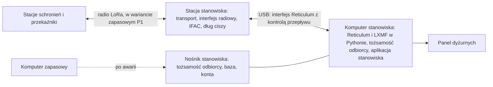

# WICI: stanowisko odbiorcze

Rozdział opisuje stanowisko, które przyjmuje zgłoszenia schronień. Stanowisko odbiorcze to rola wyznaczona przez wójta (burmistrza, prezydenta miasta), a nie konkretna jednostka; skrót OSP oznacza tylko ochotniczą straż pożarną ([koncepcja, rozdział 02](../concept/02-scenariusze-i-organizacja.html#miejsce-w-systemie-ochrony-ludnosci)). Wiadomości SA1, zasady trwałości i model zaufania wspólne dla stacji i stanowiska opisuje rozdział [Oprogramowanie](oprogramowanie.md), a interfejsy stosu rozdział [Radio](radio.md). Czynności dyżurnego opisuje [instrukcja dyżurnego](instrukcja-dyzurnego.md).

Decyzja D19 (2026-10-08): tożsamość odbiorcy, Reticulum i LXMF w Pythonie oraz baza zgłoszeń działają na **komputerze stanowiska**. **Stacja stanowiska** jest zwykłą stacją WICI w konfiguracji węzła stanowiska: przekazuje ruch sieci i łączy radio z komputerem przez USB. Komputer stanowiska jest obowiązkowy i ma zapas. Warunek utrzymania decyzji i porównanie wariantów są w części [Uzasadnienie decyzji](#uzasadnienie-decyzji). Żadna część stanowiska nie jest jeszcze zbudowana.

## Czym stanowisko różni się od schronienia

| | Stacja w schronieniu | Stanowisko odbiorcze |
|---|---|---|
| Obsługa | opiekun i zastępcy po krótkim szkoleniu; karta i przyciski | dyżurni po szkoleniu (4 h i ćwiczenie T8), grafik co najmniej 4 osób, konta i dziennik działań |
| Miejsce | obiekt bez prądu, często piwnica; stacja w skrzynce, wyjmowana w kryzysie | stały punkt z agregatem lub stacją zasilania na ≥72 h, antena w najwyższym punkcie budynku |
| Ruch | własne zgłoszenia i przekazywanie ruchu sąsiadów | każde zgłoszenie z sieci; najbardziej obciążony węzeł (model LoRa SF7: ok. 164 zgłoszenia/h, przekaźnik przed stanowiskiem ok. 95/h; P1: 121/h i 68/h) |
| Stan do przechowania | rejestr do 256 własnych zgłoszeń, skrzynka do 128 wiadomości ([pamięć FRAM](oprogramowanie.md#pamięć-fram)) | wszystkie zgłoszenia zdarzenia, rewizje, statusy, klucze odbioru, kwarantanna, karty stacji, dziennik decyzji |
| Bezpieczeństwo | jeden klucz stacji; karta odbiorcy | klucz, któremu ufa cała sieć; tożsamość zapasowa; lista zaufanych stacji |
| Dane osobowe | mało, bez nazwisk | całość zdarzenia; administrator danych, umowa powierzenia, archiwum przy ZAMKNIJ ZDARZENIE |
| Drugi kanał | goniec, PMR446 | telefon lub radio służb, PMR446 z nasłuchem, łącze do powiatu |
| Komputer | opcjonalny (poziomy 2–3), bez tożsamości sieciowej | obowiązkowy, z tożsamością odbiorcy i stosem; drugi komputer w zapasie |

## Wymagania stanowiska

| ID | Wymaganie | Sprawdzenie |
|---|---|---|
| O01 | RECEIVED dopiero po zatwierdzeniu zapisu (COMMIT) zgłoszenia, tożsamości nadawcy, klucza odbioru i intencji RECEIVED w jednej transakcji ([trwałość](oprogramowanie.md#trwałość-i-potwierdzenia)) | model, T2 |
| O02 | Deduplikacja po kluczu odbioru (nadawca, id, revision); ten sam klucz z inną treścią to konflikt bez nadpisania; powtórzony REQUEST dostaje ten sam RECEIVED i najnowszy STATUS | model, T2 |
| O03 | Zaufanie z kart stacji z pełnym kluczem; kwarantanna nieznanych nadawców bez RECEIVED (≤4 wiadomości na nadawcę, ≤256 łącznie); jedna lista zaufanych stacji: dodanie za zgodą dwóch osób, usunięcie przez jedną, wiadomości stacji usuniętej w kwarantannie z alarmem „możliwe przejęcie stacji” | model, T2, T8 |
| O04 | Panel dyżurnego według części [Panel dyżurnego](#panel-dyżurnego) | T1, T8 |
| O05 | Osobne konta dyżurnych, blokada ekranu po 5 min, dziennik działań tylko do dopisywania, przekazanie zmiany z listą otwartych zgłoszeń | T8 |
| O06 | Stanowisko przyjmuje cały ruch, jaki może do niego dotrzeć radiem (164 zgłoszenia/h przez 72 h w LoRa SF7, ok. 11 800 zgłoszeń; w P1 121/h, ok. 8700), bez odrzucania z powodu pełnej pamięci | T5, próba obciążenia |
| O07 | Przy awarii komputera przyjmowanie wraca w ≤15 min na komputerze zapasowym, bez utraty zgłoszeń z COMMIT i kluczy odbioru (wartość robocza do T8) | T2, T8 |
| O08 | Przekazywanie ruchu innych stacji przy stanowisku nie zależy od komputera | T3, T5 |
| O09 | Zasilanie stacji i komputera na ≥72 h; zmiana źródła bez przerwy pracy | T6 |
| O10 | Tożsamość odbiorcy i baza zaszyfrowane w spoczynku; komputer bez połączenia z siecią i bez samoczynnych aktualizacji; tożsamość zapasowa w kopertach poza stanowiskiem | T2 |
| O11 | Zapisywane dane: SA1, adres nadawcy, czas odbioru, klucze odbioru, dziennik działań; bez IP, MAC, telefonów i nazwisk; ZAMKNIJ ZDARZENIE z archiwum dla administratora (D13) | T2, T8 |
| O12 | Ogłoszenie adresu odbiorcy co 6 h ±20% i po starcie aplikacji; BULLETIN osobno do każdej stacji w granicach czasu nadawania profilu radiowego (LoRa SF7: około 8,5 min dla 50 stacji) | T5 |

## Budowa

Limity radiowe (czas nadawania, dług ciszy, limit ogłoszeń, IFAC, cisza radiowa) egzekwuje stacja, więc komputer nie może ich przekroczyć. Schronienia nie widzą podziału: tożsamość i adres LXMF odbiorcy, karta odbiorcy, SA1, RECEIVED i KLUCZ ZAPASOWY działają tak samo jak przy każdej innej budowie odbiorcy.

## Stacja stanowiska

Stacja stanowiska ma to samo oprogramowanie i to samo wykonanie co stacja w schronieniu. Konfigurację węzła stanowiska ustawia dokument `configure` z `"role":"wezel"` w trybie przygotowania ([protokół USB](protokol-usb.md#transfery-dzielone-na-części)); pola `addresses`, `receiver`, `stations` i `phrases` są wtedy pominięte. W tej konfiguracji stacja:

- pracuje jako węzeł transportu Reticulum z interfejsem P1 (w pilotażu LoRa, [profil](radio.md#profil-lora-pilotażu)) i drugim interfejsem przez USB ([interfejs Reticulum przez USB](radio.md#interfejs-reticulum-przez-usb-węzeł-stanowiska));
- nie ma adresu LXMF, adresu schronienia, karty odbiorcy ani fraz; nie tworzy zgłoszeń, nie wysyła TEST i nie ogłasza własnego adresu;
- przechowuje w FRAM tylko tablicę tras, znane tożsamości, ogłoszenia, dziennik zdarzeń, licznik czasu pracy i dług ciszy;
- pokazuje na ekranie głównym stan radia, `komputer_osp` albo `komputer_brak` oraz zasilanie; menu ma tylko STAN i JĘZYK ([ekran](oprogramowanie.md#ekran-i-przyciski-stacji)). Komputer nadaje sam co najmniej ogłoszenie co 6 h ±20%, więc `komputer_osp` powyżej 8 h oznacza awarię łącza albo aplikacji;
- przekazuje ruch sieci także bez komputera (O08).

Stacja stanowiska nie ma tożsamości odbiorcy, więc nie wymaga PRZENIEŚ STACJĘ. Zapasową może być dowolna sprawna stacja: w trybie przygotowania dostaje kod dostępu sieci (IFAC) i konfigurację węzła stanowiska, a potem zastępuje uszkodzoną w tym samym gnieździe anteny, zasilania i USB. Wpisy tras do odbiorcy odbudowują się po najbliższym ogłoszeniu odbiorcy; aplikacja ogłasza adres po każdym ponownym połączeniu ze stacją.

## Komputer i aplikacja stanowiska

**Stos.** Aplikacja stanowiska uruchamia Reticulum `e40191b` i LXMF `c3ff2d6` w Pythonie, w wersjach przypiętych tak jak w stacji, z interpreterem i bibliotekami z pakietu stanowiska (bez instalowania przez pip). Reticulum ma jeden interfejs: KISS do stacji przez USB, z kontrolą przepływu. Transport na komputerze jest wyłączony (przekazuje stacja), a interfejsy sieciowe Reticulum (AutoInterface, TCP, UDP) i współdzielona instancja są wyłączone. LXMF działa jak w stacji: wyłącznie dostarczenie okazjonalne, bez propagacji i znaczków pracy; ratchety według D01. Węzeł przechowywania LXMF nie należy do wydania 0.5.

**Czasy.** Limity potwierdzeń, ścieżek i ponowień w Reticulum na komputerze muszą uwzględniać dług ciszy i kolejkę interfejsu radiowego za stacją, a nie szybkość USB ([ponowienia i limity prób](radio.md#ponowienia-i-limity-prób)). Interfejs KISS sam przyjmuje 1200 b/s, a konfiguracja Reticulum ma dla każdego interfejsu opcję `bitrate`. W wersjach `e40191b` i `c3ff2d6` od niej zależą:

- limit potwierdzenia pakietu: 500 B × 8 / `bitrate` + 6 s, plus 6 s na każdy skok;
- odstęp ponowień LXMF dla wiadomości okazjonalnej: 2 × 500 B × 8 / `bitrate` + 6 s, co najmniej 10 s; przy odstępie dłuższym niż 10 s LXMF robi max(3, round(50 / odstęp)) prób zamiast 5, czyli przy wartościach używanych tu 3, potem zgłasza FAILED;
- czas oczekiwania na trasę: tyle samo co odstęp ponowień.

`bitrate` ustawia się więc nie na przepływność USB ani radia, lecz tak, aby 500 B × 8 / `bitrate` odpowiadało zmierzonemu w T3 najdłuższemu czasowi powrotu potwierdzenia przez interfejs radiowy, nie krócej niż odstęp z tabeli w [radio](radio.md#ponowienia-i-limity-prób) dla 2 skoków (w LoRa około 95 s, czyli `bitrate` ≤42 b/s; na przykład 33 b/s dla 120 s). Niska wartość nie opóźnia ogłoszeń odbiorcy, bo własne ogłoszenia nie podlegają limitowi ogłoszeń interfejsu, a komputer bez transportu nie wysyła rekurencyjnych zapytań o trasę. Potwierdzenie, które przyjdzie po limicie, nie zalicza dostarczenia; LXMF nadaje wtedy wiadomość ponownie, a deduplikacja w schronieniu chroni poprawność kosztem czasu nadawania. Zmiana kodu stosu wzorcowego otwiera ponownie D19.

**Przyjęcie.** Funkcja zwrotna dostarczenia LXMF sprawdza `signature_validated`, limit rozmiaru i stan nadawcy w bazie: stacja na liście zaufanych, usunięta z listy albo nieznana. Zaufane REQUEST i TEST przyjmuje jedna transakcja SQLite (O01, O02), a RECEIVED wychodzi po COMMIT. Wiadomość od stacji spoza listy trafia do kwarantanny bez RECEIVED; przy SOURCE_UNKNOWN aplikacja wysyła zapytanie o trasę i sprawdza podpis po nadejściu ogłoszenia. Wiadomość stacji usuniętej z listy trafia do kwarantanny tak samo, ale jest liczona i oznaczona alarmem. Schemat i przejścia stanów są w [modelu wzorcowym](../../software/reference/README.md) (`OSPStore`, `schema.sql`); aplikacja używa tego schematu. Czas odbioru to czas komputera; znacznik czasu LXMF jest ignorowany.

**Wysyłka.** RECEIVED, STATUS, REPLY i BULLETIN mają intencje w SQLite, zapisywane w tej samej transakcji co zdarzenie, które je wywołało. Kolejność jak w stacji: RECEIVED i STATUS, potem REPLY i BULLETIN. Po FAILED aplikacja ponawia jak stacja: po 1, 2, 5 i 15 min, każdy odstęp ±20%; po 6 h co 60 min. Każde ponowienie to nowa wiadomość LXMF z najwyżej 3 próbami. Po DELIVERED intencja jest zakończona, bo stacja wysyła dowód dostarczenia dopiero po COMMIT w FRAM albo trwałym odrzuceniu, a przy pełnej skrzynce i zaniku przed COMMIT go nie wysyła ([dowód po COMMIT](oprogramowanie.md#dowód-dostarczenia-po-commit), warunek D14); powtórzony REQUEST dostaje zapisany RECEIVED i najnowszy STATUS. W drodze są najwyżej 4 wiadomości naraz, a BULLETIN rozsyła się do stacji po kolei, z postępem w panelu (dla 50 stacji ok. 8,5 min w LoRa SF7, ok. 12 min w P1). Nieodesłany STATUS dla tej samej pary (id, revision) zastępuje się nowszym. Numer `event` STATUS, REPLY i BULLETIN to max(ostatni numer tego licznika + 1, sekundy od 2026-01-01 00:00 UTC) ([SA1](oprogramowanie.md#wiadomości-sa1)), więc numeracja rośnie także po odtworzeniu bazy z kopii albo po przejściu na komputer zapasowy. Aplikacja przy starcie porównuje zegar komputera z czasem ostatniego nadanego `event` w bazie i nie startuje, gdy zegar jest wcześniejszy; dyżurny ustawia wtedy zegar według instrukcji. Przełożony nośnik niesie bieżącą bazę, więc ta kontrola wystarcza. Nie wystarcza po odtworzeniu bazy z kopii, bo kopia nie zna numerów nadanych po jej wykonaniu (przykład: kopia z 09:00, STATUS nadany o 10:00, komputer zapasowy wskazuje 09:50). Każda kopia bazy dostaje przy wykonaniu znacznik „kopia”, zapisywany przez aplikację w samej kopii, nie w bazie roboczej. Baza ze znacznikiem, otwarta poleceniem odtworzenia w panelu (dwóch dyżurnych) albo skopiowana ręcznie, uruchamia tryb odzyskania; znacznik znika dopiero w transakcji, która kończy odzyskanie. W trybie odzyskania aplikacja wymaga potwierdzenia zegara przez dyżurnego z dokładnością ±1 min według niezależnego źródła (telefon w sieci komórkowej, zegar sterowany radiowo, komputer główny), a przed pierwszym nadaniem podnosi każdy licznik `event` do max(zapisany + 1, sekundy + 3600) w jednej transakcji. Zapas 1 h pokrywa łączną rozbieżność zegara komputera, który nadawał, i zegara komputera odzyskania; sprawdzenie zegara na początku każdego dyżuru utrzymuje każdą z nich w ±1 min ([instrukcja dyżurnego](instrukcja-dyzurnego.md)). Kolejność rewizji jednego zgłoszenia nie jest gwarantowana w sieci: aplikacja przyjmuje każdą rewizję osobno, pokazuje najnowszą, a starszą, która przyszła później, zapisuje bez zmiany widoku ([cykl życia](oprogramowanie.md#cykl-życia-zgłoszenia)).

**Zaufanie.** Baza aplikacji stanowiska przechowuje jedną listę zaufanych stacji z ich kartami; na jej podstawie aplikacja decyduje o każdej wiadomości. Dodanie stacji do listy wymaga karty stacji (plik lub QR), porównania odcisku z ekranem stacji albo z kartą w ewidencji i zgody dwóch zalogowanych dyżurnych; tak samo wraca stacja usunięta przez pomyłkę. Usunięcie z listy wykonuje jeden zalogowany dyżurny z wpisem do dziennika działań, bo usunięcie tylko odbiera zaufanie. Wiadomości stacji usuniętej trafiają do kwarantanny z alarmem „możliwe przejęcie stacji”; limit 4 wiadomości na nadawcę chroni kwarantannę przed zapełnieniem. Po ponownym dodaniu stacji jej wiadomości z kwarantanny są usuwane, bo stacja ponawia je do RECEIVED. Zatwierdzenie w kwarantannie dotyczy pojedynczej wiadomości i nie dodaje nadawcy do zaufanych.

**Ogłoszenia.** Aplikacja ogłasza adres odbiorcy po starcie, po każdym ponownym połączeniu ze stacją, co 6 h ±20% i na polecenie dyżurnego. Ogłoszenia przechodzą przez limit ogłoszeń interfejsu radiowego stacji (2% czasu zegarowego). W ciszy radiowej stacja ich nie nadaje.

**Nośnik i szyfrowanie.** Tożsamość odbiorcy, baza SQLite (`journal_mode=DELETE`, `synchronous=FULL`) i plik kont leżą na nośniku stanowiska: zaszyfrowanym dysku USB SSD. Klucz danych nośnika jest zaszyfrowany kluczem wyprowadzonym Argon2id z hasła stanowiska, więc zmiana hasła przepakowuje tylko ten klucz. Hasło wpisuje się przy starcie aplikacji (początek zdarzenia, zmiana komputera, restart); aplikacja pracuje potem bez przerwy. Hasło leży w numerowanej, zaklejonej kopercie przy stanowisku; po otwarciu koperty osoba utrzymująca system zmienia hasło po zdarzeniu albo przy najbliższym przeglądzie i zakłada nową kopertę. Nośnik działa w każdym przygotowanym komputerze stanowiska, bo klucz nie zależy od magazynu systemowego komputera. Przy każdym przekazaniu zmiany aplikacja zapisuje kopię bazy (API kopii SQLite, ze sprawdzeniem integralności) na drugi zaszyfrowany nośnik, przechowywany przy komputerze zapasowym. Trwałość nośnika przy odcięciu zasilania sprawdza T2.

**Komputer.** Laptop przypisany do stanowiska (wbudowany akumulator działa jak zasilacz awaryjny), z pakietem stanowiska i systemem z listy pakietu START (D04), z pełnym szyfrowaniem dysku, bez usypiania i samoczynnych aktualizacji. Wi-Fi, Bluetooth i Ethernet są wyłączone w systemie; jedynym połączeniem jest USB do stacji. Drugi komputer tego samego typu ma ten sam pakiet i jest sprawdzany w przeglądzie kwartalnym.

**ZNISZCZ DANE i ZAMKNIJ ZDARZENIE.** ZNISZCZ DANE na komputerze stanowiska usuwa tożsamość odbiorcy, bazę i plik kont z nośnika i z kopii; decyduje fizyczne zniszczenie obu nośników, które nakazuje [instrukcja dyżurnego](instrukcja-dyzurnego.md#awarie). ZAMKNIJ ZDARZENIE eksportuje zaszyfrowane archiwum dla administratora danych (D13) i usuwa treść zgłoszeń; tożsamości i klucze odbioru zostają ([model zaufania](oprogramowanie.md#model-zaufania-i-kluczy)).

## Panel dyżurnego

Panel nasłuchuje wyłącznie na 127.0.0.1. Wymaga logowania; konta i hasła tworzy się podczas przygotowania jak dla opiekuna ([API strony](oprogramowanie.md#api-lokalnej-strony-poziomy-23)).

- sortuje zgłoszenia według pilności, potem czasu odbioru; zgłoszenie z pilnością 2 uruchamia alarm dźwiękowy;
- „PRZECZYTANE” jednym przyciskiem wysyła STATUS ze state=2;
- pokazuje TEST osobno i pozwala potwierdzić kilka TEST zbiorczo, po sprawdzeniu adresu każdego;
- nie wyśle stanu 5 bez REPLY z instrukcją;
- wyśle stan 3 („pomoc skierowana”) tylko z wpisanym źródłem potwierdzenia skierowania pomocy (podmiot, który dysponuje siłami, funkcja osoby, kanał) i czasem potwierdzenia; stan 4 („przekazane dalej”) zapisuje komu i kiedy przekazano zgłoszenie, bez potwierdzenia skierowania; oba wpisy zostają w bazie i dzienniku działań, nie idą radiem;
- ma widok kwarantanny z wiadomościami „do weryfikacji”, a przy stacjach usuniętych z listy alarm „możliwe przejęcie stacji” z liczbą odebranych od nich wiadomości (z powtórzeniami);
- wysyła BULLETIN osobno do każdej stacji i pokazuje postęp rozsyłania;
- pokazuje stan węzła: połączenie ze stacją, czas od ostatniego pakietu z radia, liczbę intencji w drodze i w oczekiwaniu, wiek najstarszej;
- przekazanie zmiany: otwarte zgłoszenia, sprawy w stanie 4 bez potwierdzenia skierowania pomocy, niewysłane intencje, kwarantanna, kopia bazy.

| Adres | Działanie |
|---|---|
| `GET /operator` | logowanie dyżurnego |
| `GET /api/operator/queue` | zgłoszenia, TEST, kwarantanna, intencje |
| `POST /api/operator/status` | decyzja; stan 3 tylko ze źródłem i czasem potwierdzenia skierowania pomocy, stan 5 tylko razem z REPLY |
| `POST /api/operator/reply` | odpowiedź REPLY do zgłoszenia |
| `POST /api/operator/bulletin` | komunikat BULLETIN, osobno do każdej stacji |
| `POST /api/operator/quarantine` | zatwierdzenie pojedynczej wiadomości (nadawca, id, revision) bez dodania nadawcy do zaufanych albo jej odrzucenie |
| `POST /api/operator/trust` | dodanie stacji do listy zaufanych z karty; zgoda dwóch zalogowanych osób |
| `POST /api/operator/trust/remove` | usunięcie stacji z listy zaufanych; jeden zalogowany dyżurny |
| `POST /api/operator/announce` | ogłoszenie adresu odbiorcy |
| `POST /api/operator/backup` | kopia bazy na drugi nośnik, ze znacznikiem „kopia” |
| `POST /api/operator/restore` | odtworzenie bazy z kopii; zgoda dwóch zalogowanych dyżurnych, potem tryb odzyskania z potwierdzeniem zegara |
| `POST /api/operator/close` | ZAMKNIJ ZDARZENIE |
| `POST /api/operator/destroy` | ZNISZCZ DANE; podwójne potwierdzenie |
| `GET /health` | stan aplikacji, zapisu i połączenia ze stacją, liczniki odrzutów |

Plan stanowiska nazywa konkretnie drugi kanał: goniec, PMR446 z ustalonym kanałem i godzinami nasłuchu, służby na miejscu.

## Zestaw stanowiska

1. Dwie stacje WICI w konfiguracji węzła stanowiska; zapasową może być dowolna stacja przełączona w trybie przygotowania.
2. Stały komputer stanowiska z pakietem stanowiska i drugi, przygotowany komputer tego samego typu.
3. Nośnik stanowiska (zaszyfrowany dysk USB SSD z tożsamością odbiorcy, bazą i kontami), drugi nośnik na kopię bazy i zapasowy pusty nośnik na odbudowę stanowiska po przejęciu.
4. Antena kolinearna w najwyższym dostępnym punkcie budynku, z odgromnikiem, z dala od stanowiska kierowania ([rozdział 07](../concept/07-zagrozenia-i-odpornosc.html)).
5. Zasilanie stacji i komputerów na ≥72 h: agregat lub stacja zasilania z deklaracją zgodności UE.
6. Koperty: hasło stanowiska i hasła dyżurnych przy stanowisku; paczka tożsamości zapasowej i jej hasło u organizatora sieci, w dwóch różnych miejscach.
7. Papierowy dziennik zgłoszeń i decyzji, formularze do przekazania zgłoszeń służbom.
8. Para radiotelefonów PMR446 z nasłuchem w ustalonych godzinach; łącze satelitarne do powiatu, jeśli jest dostępne.
9. Grafik co najmniej 4 dyżurnych.

## Przygotowanie i przeglądy

Osoba utrzymująca system, w porozumieniu z organizatorem sieci:

1. Instaluje pakiet stanowiska na obu komputerach i sprawdza start aplikacji z nośnikiem na każdym z nich.
2. Na komputerze bez połączenia z siecią tworzy w aplikacji tożsamość główną odbiorcy na nośniku stanowiska oraz tożsamość zapasową. Paczkę zapasową zaszyfrowaną kluczem z hasła tożsamości zapasowej (co najmniej 6 słów z listy, Argon2id) i samo hasło wkłada do dwóch zaplombowanych kopert, które organizator przechowuje w dwóch różnych miejscach, poza stanowiskiem ([klucz odbiorcy](oprogramowanie.md#model-zaufania-i-kluczy)).
3. Eksportuje kartę odbiorcy (obie tożsamości) do konfiguracji stacji schronień.
4. Importuje karty stacji po porównaniu odcisków, za zgodą dwóch osób.
5. Konfiguruje obie stacje jako węzły stanowiska z kodem dostępu sieci, montuje antenę i zasilanie, wysyła z jednego schronienia TEST i zapisuje wynik w ewidencji.

Co kwartał: start komputera zapasowego z nośnikiem stanowiska (aplikacja bez nadawania albo w oknie TEST sieci), sprawdzenie kopii bazy, zasilania i plomb kopert. Raz w roku: przegląd techniczny stacji jak w [projekcie](projekt.md#przechowywanie-i-przeglądy) i ćwiczenie zmiany komputera (O07).

## Działanie przy awarii

| Awaria | Skutek | Postępowanie |
|---|---|---|
| komputer | brak przyjęć i decyzji; sieć przekazuje ruch; schronienia ponawiają zgłoszenia | nośnik do komputera zapasowego (O07); aplikacja ogłasza adres po starcie, a ponowienia schronień dostarczają zaległe zgłoszenia; deduplikacja nie przyjmie ich dwa razy |
| stacja stanowiska | brak łączności radiowej stanowiska | stacja zapasowa w tym samym gnieździe; tożsamość odbiorcy się nie zmienia |
| nośnik stanowiska | utrata bazy od ostatniej kopii | kopia z ostatniego przekazania zmiany, otwarta w trybie odzyskania (potwierdzenie zegara, podniesienie liczników `event`); zgłoszenia przyjęte po kopii dostały już RECEIVED, więc schronienia ich nie ponowią: dyżurny odtwarza je razem z decyzjami z dziennika papierowego, a w razie wątpliwości pyta schronienia drugim kanałem |
| przejęcie komputera lub nośnika | klucz odbiorcy ujawniony | tożsamość zapasowa z obu kopert na komputerze zapasowym, z nowym nośnikiem i pustą bazą. Zanim aplikacja zacznie przyjmować zgłoszenia, osoba utrzymująca system wczytuje do bazy karty zaufanych stacji z ewidencji (za zgodą dwóch dyżurnych) i zakłada od nowa konta dyżurnych z nowymi hasłami; schronienia wysyłają niepotwierdzone zgłoszenia ponownie na nowy adres, a otwarte sprawy dyżurny odtwarza z dziennika papierowego; schronienia przełączają się na polecenie słowne lub gońca (KLUCZ ZAPASOWY) |
| zasilanie | jak komputer, po wyczerpaniu akumulatora laptopa | zmiana źródła bez przerwy (O09) |
| brak dyżurnego | RECEIVED działa, PRZECZYTANE nie; schronienia przy pilności 2 dostają alarm `brak_odczytu` | grafik; PMR i goniec |

## Uzasadnienie decyzji

Porównano trzy warianty:

- **A.** Stacja w roli odbiorcy (tożsamość odbiorcy, karty i kolejka `incoming` w MCU i FRAM) z komputerem do bazy i panelu; stan specyfikacji przed D19.
- **B.** Wariant A z trybem awaryjnym: bez komputera stacja sama zatwierdza przyjęcie w FRAM, a dyżurny czyta zgłoszenia na ekranie 5 × 20 znaków i odpowiada przyciskami.
- **C.** Tożsamość odbiorcy i stos LXMF na komputerze, stacja stanowiska jako węzeł transportu (przyjęty).

Przed D19 specyfikacja nie gwarantowała przyjmowania zgłoszeń bez komputera: bez laptopa stacja w roli odbiorcy odbierała zgłoszenia do `incoming` (128 miejsc, zapełnione po około godzinie przy 121/h), ale nie wysyłała RECEIVED ani nie pokazywała treści. Schronienie dostawało alarm braku potwierdzenia i wysyłało gońca, tak samo jak przy wyłączonym odbiorcy.

| Kryterium | A | B | C |
|---|---|---|---|
| Przyjmowanie zgłoszeń bez komputera | nie | tylko przy kilku zgłoszeniach na godzinę | nie; zapas komputera i nośnik (O07) |
| Przekazywanie ruchu bez komputera | tak | tak | tak |
| Ryzyko zapchania | stałe limity w MCU i FRAM: `incoming` 128, kolejka ≥512 intencji, karty ≥256 | jak A, plus zgłoszenia przyjęte bez komputera | tylko czas nadawania |
| Stos w najbardziej obciążonym węźle | microReticulum na MCU | jak A | implementacja wzorcowa |
| Wpływ na stację w schronieniu | rola odbiorcy w każdym obrazie; FRAM dla roli odbiorcy (≈403 KiB); najcięższy budżet RAM, gdy obraz stacji już ma w szczycie 4,5% wolnej RAM wobec progu 30% ([pomiar](../../firmware/README.md#pamięć-ram)) | jak A, plus tryb awaryjny i uzgadnianie dwóch magazynów | jedna rola; dochodzi interfejs USB Reticulum |
| Klucz odbiorcy przy przejęciu komputera | bezpieczny w stacji, ale przejęty laptop wysyła STATUS, REPLY i BULLETIN | jak A | ujawniony; ogranicza go tożsamość zapasowa, szyfrowanie nośnika i komputer bez sieci |

Wariant B odrzucono: przy kilkudziesięciu zgłoszeniach na godzinę ekran stacji nie wystarcza dyżurnemu, a przyjęcie w dwóch miejscach (FRAM i SQLite) wymaga uzgadniania rewizji, statusów i kluczy odbioru. Mógłby wrócić jako przenośne stanowisko zastępcze, jeśli T8 pokaże taką potrzebę.

Żaden wariant nie zmienia pojemności sieci. Około 121 zgłoszeń/h na stanowisku i 68/h na przekaźniku przed stanowiskiem wynika z czasu nadawania na jednym kanale P1; dla LoRa SF7 w pilotażu model daje około 164/h i 95/h. Podnosi je tylko drugi odbiorca albo podział sieci.

**Warunek utrzymania.** T3 musi pokazać Reticulum i LXMF w Pythonie za stacją w konfiguracji węzła stanowiska, z limitami czasu zgodnymi z profilem radiowym (w pilotażu LoRa SF7), ustawionymi samą konfiguracją. Jeśli wymagałoby to zmian w kodzie stosu wzorcowego, D19 wraca do wariantu A z obowiązkowym komputerem. Komputer stanowiska uruchamia kod Reticulum i LXMF, więc pakiet stanowiska podlega ich licencjom tak jak pakiet START (F08).
